# मुक्तिबोध

**अप्प दीपो भवः**  
**अंक 01 • मार्च 2026**  
**gyanmarg.guru**

> यह MDX manuscript PDF के 35 pages को page-wise structure में रखता है। प्रत्येक page के साथ original rendered image reference और OCR text दिया गया है, ताकि alignment और wording visually cross-check हो सके।

## Source PDF Visual Index

सभी pages नीचे उसी क्रम में दिए गए हैं जिस क्रम में PDF में हैं।

---

## Page 01

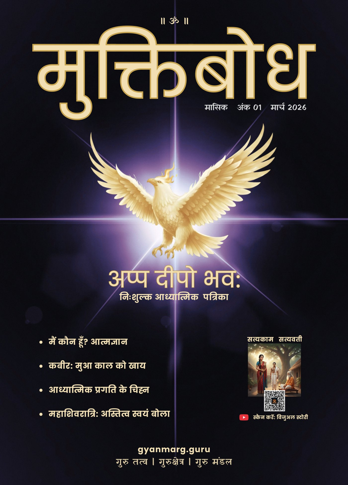

### OCR / Manuscript Text - Page 01

मुक्तिबोध

मासिक अंक 01 • मार्च 2026

gyanmarg.guru

निःशुल्क आध्यात्मिक पत्रिका

अप्प दीपो भवः

मुख्य विषय:
- मैं कौन हूँ? आत्मज्ञान
- कबीर: मुआ काल को खाय
- आध्यात्मिक प्रगति के चिह्न
- महाशिवरात्रिः अस्तित्व स्वयं बोला
- मासिक सत्यकाम
- स्कैन करें: विजुअल स्टोरी सत्यवती

गुरु तत्व | गुरुक्षेत्र | गुरु मंडल

---

## Page 02

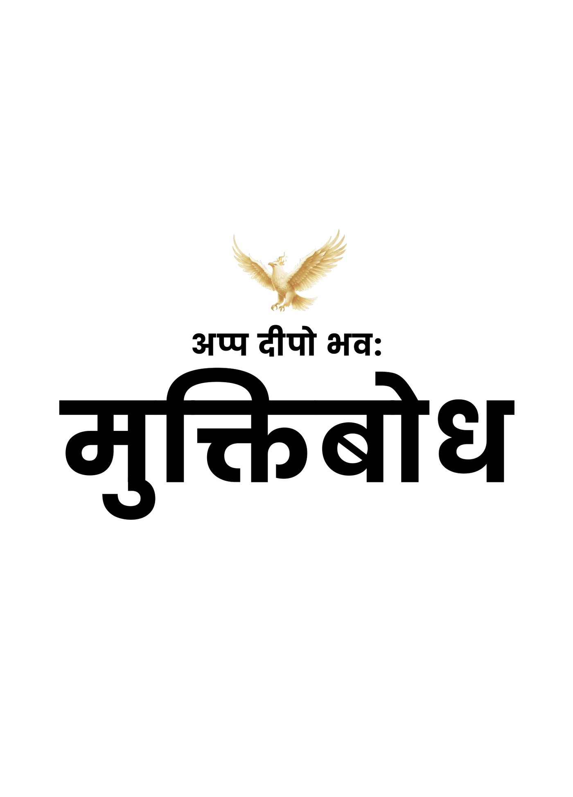

### OCR / Manuscript Text - Page 02

अप्प दीपो भवः

मुक्तिबोध

---

## Page 03

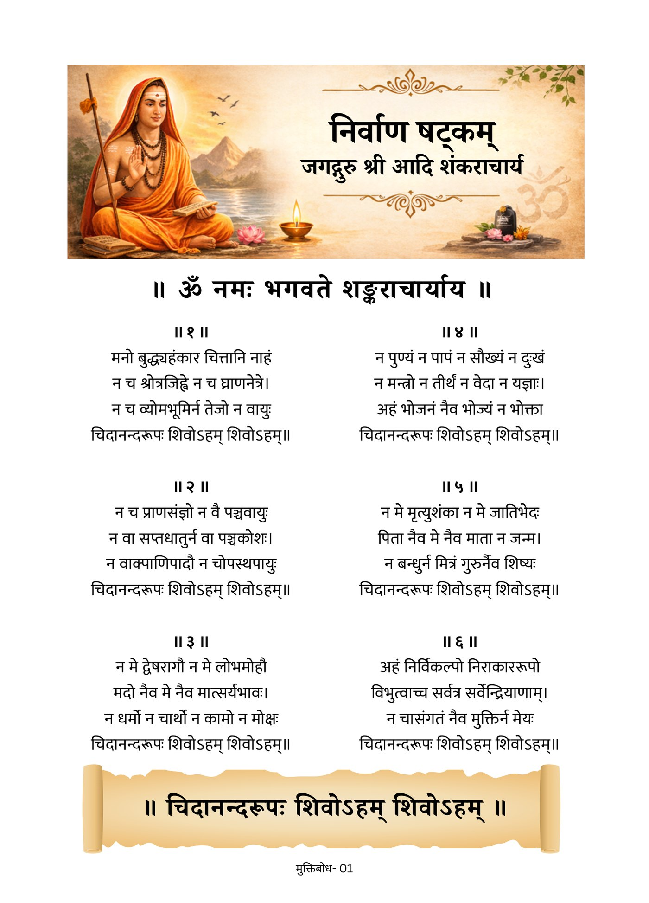

### OCR / Manuscript Text - Page 03

निर्वाण षटकम्‌

॥ ॐ नमः भगवते शङ्कराचार्याय ॥

मनो बुद्धयहंकार चित्तानि नाहं
न च श्रोत्रजिह्वे न च घ्राणनेत्रे।
न च व्योमभूमिर्न तेजो न वायुः
चिदानन्दरूपः शिवोऽहम्‌ शिवोऽहम्‌॥

॥२॥
न च प्राणसंज्ञो न वै पञ्चवायुः
न वा सप्तधातुर्न वा पञ्चकोशः।
न वाक्पाणिपादौ न चोपस्थपायुः
चिदानन्दरूपः शिवोऽहम्‌ शिवोऽहम्‌॥

॥३॥
न मे द्वेषरागौ न मे लोभमोहौ
मदो नैव मे नैव मात्सर्यभावः।

न धर्मो न चार्थो न कामो न मोक्षः
चिदानन्दरूपः शिवोऽहम्‌ शिवोऽहम्‌॥

॥४॥
न पुण्यं न पापं न सौख्यं न दुःखं
न मन्त्रो न तीर्थे न वेदा न यज्ञाः।
अहं भोजनं नैव भोज्यं न भोक्ता

चिदानन्दरूपः शिवोऽहम्‌ शिवोऽहम्‌॥

॥५॥
न मे मृत्युशंका न मे जातिभेदः
पिता नैव मे नैव माता न जन्म।
न बन्धुर्न मित्रं गुरुर्नैव शिष्यः
चिदानन्दरूपः शिवोऽहम्‌ शिवोऽहम्‌॥

॥६॥
अहं निर्विकल्पो निराकाररूपो
विभुत्वाच्च सर्वत्र सर्वेन्द्रियाणाम्‌।
न चासंगतं नैव मुक्तिर्न मेयः
चिदानन्दरूपः शिवोऽहम्‌ शिवोऽहम्‌॥

॥ चिदानन्दरूपः शिवोऽहम्‌ शिवोऽहम्‌ ॥

मुक्तिबोध- 01

---

## Page 04

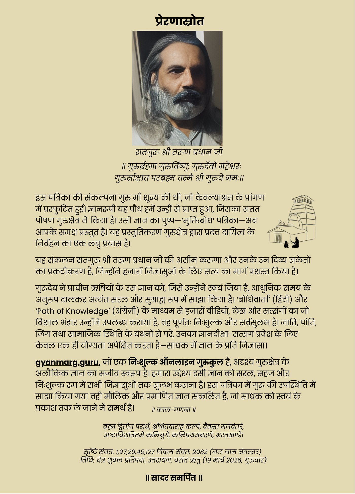

### OCR / Manuscript Text - Page 04

सवगुळ श्री तळण प्रधान जी
॥ गुरुर्ब्रह्मा गुरुविष्णुः गुरुदेवो महेश्वरः
गुरर्साक्षात परब्रह्म तस्मै श्री गुरवे नम:॥

इस पत्रिका की संकल्पना गुरु माँ शून्य की थी, जो कैवल्याश्रम के प्रांगण ऋवेः
में प्रस्फुटित हुड ज्ञानरूपी यह पौध हमें उन्हीं से प्राप्त हुआ, जिसका मतत =
पोषण aa ने किया है। उसरी ज्ञान का पुष्प-'मुक्तिबोध' पत्रिका-अब ag (HL =
आपके समक्ष प्रस्तुत है। यह प्रस्तुतिकरण गुरुक्षेत्र द्वारा प्रदत्त दायित्व के fa&gt; |

निर्वहन का एक OE प्रयास है। LB lye

यह संकलन सतगुरु श्री तरुण प्रधान जी की असीम करूणा और उनके उन दिव्य संकेतों
का प्रकटीकरण है, जिन्होंने हजारों जिज्ञासुओं के लिए सत्य का मार्ग प्रशस्त किया है।

गुरुदेव ने प्राचीन ऋषियों के उस ज्ञान को, जिसे उन्होंने स्वयं जिया है, आधुनिक समय के
अनुरुप ढाळकर अत्यंत सरळ और सुय्राह्य रुप A साझा किया है। 'बोधिवार्ता' (हिंदी) और
‘Path of Knowledge’ (अंग्रेज़ी) के माध्यम से हजारों वीडियो, लेख और सत्संगों का जो
विशाल भंडार उन्होंने उपलब्ध कराया है, वह पूर्णतः निःशुल्क और सर्वसुळभ है। जाति, पांति,
लिंग तथा सामाजिक स्थिति के बंधनों से परे, उनका जानवीक्षा-सत्मंग प्रवेश के लिए
केवल एक ही योग्यता अपेक्षित करता है-साधक में ज्ञान के प्रति जिज्ञासा।

gyanmarg.guru, जो एक निःशुल्क ऑनलाइन गुरुकुळ है, seed गुरुक्षेत्र के
अलौकिक ज्ञान का सजीव स्वरुप है। हमारा उद्देश्य इसी ज्ञान को सरळ, सहज और
निःशुल्क रुप में सभी जिज्ञासुओं तक सुलभ कराना है। इस पत्रिका में गुरु की उपस्थिति में
साझा किया गया वही मौलिक और प्रमाणित ज्ञान संकलित है, जो साधक को स्वयं के
प्रकाश तक लळे जाने में समर्थे el ॥।क्राल-गणना॥

ब्रहम द्वितीय परार्ध श्रीश्चितवाराह कल्पे, वैवम्त मनव॑तरे
अष्टाविंशतितमे कलियुगे, कलिप्रथमचटरणे, भरतखण्डे।

सृष्टि संवत: 1,97,29,49,127 विक्रम Adc: 2082 (नळ नाम संवत्सर)
तिथिः चैत्र क्षुक्ल प्रतिपदा, उत्तरायण, वंत ऋतु (19 मार्च 2026, गुरुवार)

॥ सादर समपित ॥

---

## Page 05

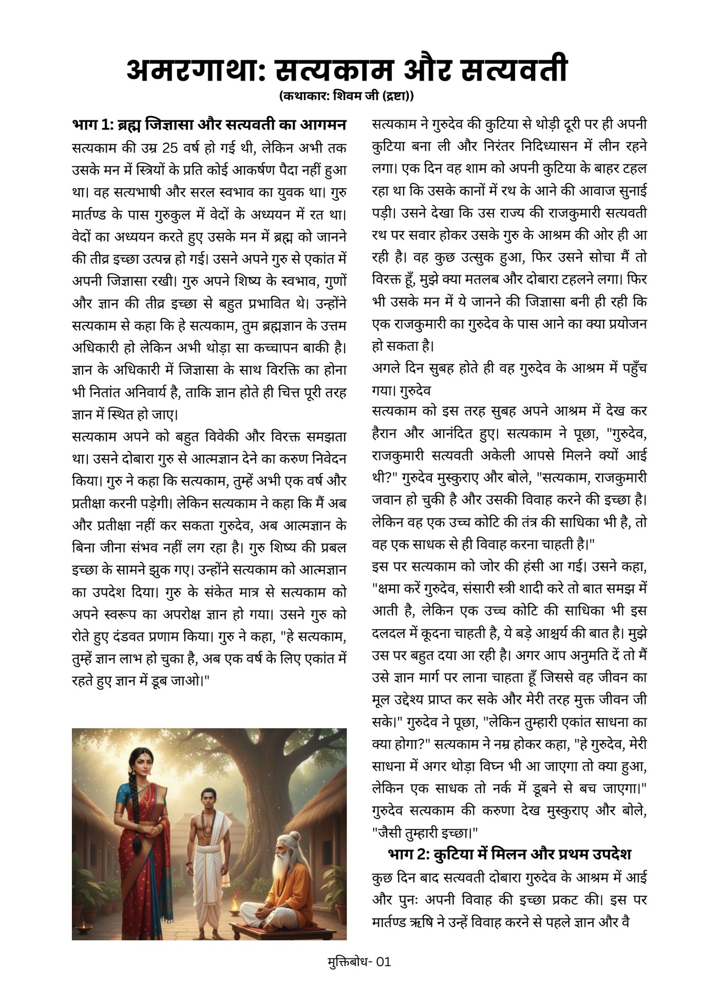

### OCR / Manuscript Text - Page 05

अमरगाथा: सत्यकाम और सत्यवती

(कथाकार: शिवम जी (द्रष्टा)

भाग 1: ब्रह्म जिज्ञासा और सत्यवती का आगमन
सत्यकाम की उम्र 25 वर्ष हो गई थी, लेकिन अभी तक
उसके मन में स्त्रियों के प्रति कोई आकर्षण पैदा नहीं हुआ
था। वह सत्यभाषी और सरल स्वभाव का युवक था। गुरु
मार्तण्ड के पास गुरुकुल में वेदों के अध्ययन में रत था।
वेदों का अध्ययन करते हुए उसके मन में ब्रह्म को जानने
की तीव्र इच्छा उत्पन्न हो गई। उसने अपने गुरु से एकांत में
अपनी जिज्ञासा रखी। गुरु अपने शिष्य के स्वभाव, गुणों
और ज्ञान की तीव्र इच्छा से बहुत प्रभावित थे। उन्होंने
सत्यकाम से कहा कि हे सत्यकाम, तुम ब्रह्मज्ञान के उत्तम
अधिकारी हो लेकिन अभी थोड़ा सा कच्चापन बाकी है।
ज्ञान के अधिकारी में जिज्ञासा के साथ विरक्ति का होना
भी नितांत अनिवार्य है, ताकि ज्ञान होते ही चित्त पूरी तरह
ज्ञान में स्थित हो जाए।

सत्यकाम अपने को बहुत विवेकी और विरक्त समझता
था। उसने दोबारा गुरु से आत्मज्ञान देने का करुण निवेदन
किया। गुरु ने कहा कि सत्यकाम, तुम्हें अभी एक वर्ष और
प्रतीक्षा करनी पड़ेगी। लेकिन सत्यकाम ने कहा कि मैं अब
और प्रतीक्षा नहीं कर सकता गुरुदेव, अब आत्मज्ञान के
बिना जीना संभव नहीं लग रहा है। गुरु शिष्य की प्रबल
इच्छा के सामने झुक गए। उन्होंने सत्यकाम को आत्मज्ञान
का उपदेश दिया। गुरु के संकेत मात्र से सत्यकाम को
अपने स्वरूप का अपरोक्ष ज्ञान हो गया। उसने गुरु को
रोते हुए दंडवत प्रणाम किया। गुरु ने कहा, "हे सत्यकाम,
तुम्हें ज्ञान लाभ हो चुका है, अब एक वर्ष के लिए एकांत में
रहते हुए ज्ञान में डूब जाओ।"

सत्यकाम ने गुरुदेव की कुटिया से थोड़ी दूरी पर ही अपनी
कुटिया बना ली और निरंतर निदिध्यासन में लीन रहने
लगा। एक दिन वह शाम को अपनी कुटिया के बाहर टहल
रहा था कि उसके कानों में रथ के आने की आवाज सुनाई
पड़ी। उसने देखा कि उस राज्य की राजकुमारी सत्यवती
रथ पर सवार होकर उसके गुरु के आश्रम की ओर ही आ
रही है। वह कुछ उत्सुक हुआ, फिर उसने सोचा मैं तो
विरक्त हूँ, मुझे क्या मतलब और दोबारा टहलने लगा। फिर
भी उसके मन में ये जानने की जिज्ञासा बनी ही रही कि
एक राजकुमारी का गुरुदेव के पास आने का क्या प्रयोजन
हो सकता है।
अगले दिन सुबह होते ही वह गुरुदेव के आश्रम में पहुँच
गया। गुरुदेव
सत्यकाम को इस तरह सुबह अपने आश्रम में देख कर
हैरान और आनंदित हुए। सत्यकाम ने पूछा, "गुरुदेव,
राजकुमारी सत्यवती अकेली आपसे मिलने क्यों आई
थी?" गुरुदेव मुस्कुराए और बोले, "सत्यकाम, राजकुमारी
जवान हो चुकी है और उसकी विवाह करने की इच्छा है।
लेकिन वह एक उच्च कोटि की तंत्र की साधिका भी है, तो
वह एक साधक से ही विवाह करना चाहती है।"
इस पर सत्यकाम को जोर की हंसी आ गई। उसने कहा,
"क्षमा करें गुरुदेव, संसारी स्त्री शादी करे तो बात समझ में
आती है, लेकिन एक उच्च कोटि की साधिका भी इस
दलदल में कूदना चाहती है, ये बड़े आश्चर्य की बात है। मुझे
उस पर बहुत दया आ रही है। अगर आप अनुमति दे तो मैं
उसे ज्ञान मार्ग पर लाना चाहता हूँ जिससे वह जीवन का
मूल उद्देश्य प्राप्त कर सके और मेरी तरह मुक्त जीवन जी
सके।" गुरुदेव ने पूछा, "लेकिन तुम्हारी एकांत साधना का
क्या होगा?" सत्यकाम ने नम्र होकर कहा, "हे गुरुदेव, मेरी
साधना में अगर थोड़ा विघ्न भी आ जाएगा तो क्या हुआ,
लेकिन एक साधक तो नर्क में डूबने से बच जाएगा।"
गुरुदेव सत्यकाम की करुणा देख मुस्कुराए और बोले,
"जैसी तुम्हारी इच्छा।"

भाग 2: कुटिया में मिलन और प्रथम उपदेश
कुछ दिन बाद सत्यवती दोबारा गुरुदेव के आश्रम में आई
और पुनः अपनी विवाह की इच्छा प्रकट की। इस पर
मार्तण्ड ऋषि ने उन्हें विवाह करने से पहले ज्ञान और वै

मुक्तिबोध- 01

---

## Page 06

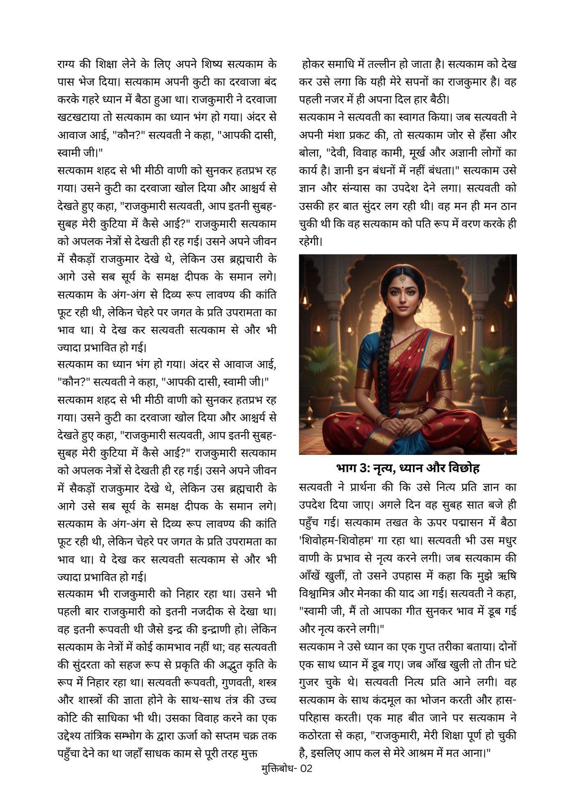

### OCR / Manuscript Text - Page 06

राग्य की शिक्षा लेने के लिए अपने शिष्य सत्यकाम के
पास भेज दिया। सत्यकाम अपनी कुटी का दरवाजा बंद
करके गहरे ध्यान में बैठा हुआ था। राजकुमारी ने दरवाजा
खटखटाया तो सत्यकाम का ध्यान भंग हो गया। अंदर से
आवाज आई, "कौन?" सत्यवती ने कहा, "आपकी दासी,
स्वामी जी।"

सत्यकाम शहद से भी मीठी वाणी को सुनकर हतप्रभ रह
गया। उसने कुटी का दरवाजा खोल दिया और आश्चर्य से
देखते हुए कहा, "राजकुमारी सत्यवती, आप इतनी सुबह-
सुबह मेरी कुटिया में कैसे आई?" राजकुमारी सत्यकाम
को अपलक नेत्रों से देखती ही रह गई। उसने अपने जीवन
में सैकड़ों राजकुमार देखे थे, लेकिन उस ब्रह्मचारी के
आगे उसे सब सूर्य के समक्ष दीपक के समान लगे।
सत्यकाम के अंग-अंग से दिव्य रूप लावण्य की कांति
फूट रही थी, लेकिन चेहरे पर जगत के प्रति उपरामता का
भाव था। ये देख कर सत्यवती सत्यकाम से और भी
ज्यादा प्रभावित हो गई।

सत्यकाम का ध्यान भंग हो गया। अंदर से आवाज आई,
"कौन?" सत्यवती ने कहा, "आपकी दासी, स्वामी siti"
सत्यकाम शहद से भी मीठी वाणी को सुनकर हतप्रभ रह
गया। उसने कुटी का दरवाजा खोल दिया और आश्चर्य से
देखते हुए कहा, "राजकुमारी सत्यवती, आप इतनी सुबह-
सुबह मेरी कुटिया में कैसे आई?" राजकुमारी सत्यकाम
को अपलक नेत्रों से देखती ही रह गई। उसने अपने जीवन
में सैकड़ों राजकुमार देखे थे, लेकिन उस ब्रह्मचारी के
आगे उसे सब सूर्य के समक्ष दीपक के समान लगे।
सत्यकाम के अंग-अंग से दिव्य रूप लावण्य की कांति
फूट रही थी, लेकिन चेहरे पर जगत के प्रति उपरामता का
भाव था। ये देख कर सत्यवती सत्यकाम से और भी
ज्यादा प्रभावित हो गई।

सत्यकाम भी राजकुमारी को निहार रहा था। उसने भी
पहली बार राजकुमारी को इतनी नजदीक से देखा था।
वह इतनी रूपवती थी जैसे इन्द्र की इन्द्राणी हो। लेकिन
सत्यकाम के नेत्रों में कोई कामभाव नहीं था; वह सत्यवती
की सुंदरता को सहज रूप से प्रकृति की अद्भुत कृति के
रूप में निहार रहा था। सत्यवती रूपवती, गुणवती, शस्त्र
और शास्त्रों की ज्ञाता होने के साथ-साथ तंत्र की उच्च
कोटि की साधिका भी थी। उसका विवाह करने का एक
उद्देश्य तांत्रिक सम्भोग के द्वारा ऊर्जा को सप्तम चक्र तक
पहुँचा देने का था जहाँ साधक काम से पूरी तरह मुक्त

होकर समाधि में तल्लीन हो जाता है। सत्यकाम को देख
कर उसे लगा कि यही मेरे सपनों का राजकुमार है। वह
पहली नजर में ही अपना दिल हार बैठी।

सत्यकाम ने सत्यवती का स्वागत किया। जब सत्यवती ने
अपनी मंशा प्रकट की, तो सत्यकाम जोर से हँसा और
बोला, "देवी, विवाह कामी, मूर्ख और अज्ञानी लोगों का
कार्य él ज्ञानी इन deat में नहीं बंधता।" सत्यकाम उसे
ज्ञान और संन्यास का उपदेश देने लगा। सत्यवती को
उसकी हर बात सुंदर लग रही थी। वह मन ही मन ठान
चुकी थी कि वह सत्यकाम को पति रूप में वरण करके ही
रहेगी।

भाग 3: नृत्य, ध्यान और विछोह

सत्यवती ने प्रार्थना की कि उसे नित्य प्रति ज्ञान का
उपदेश दिया जाए। अगले दिन वह सुबह सात बजे ही
पहुँच गई। सत्यकाम तखत के ऊपर पद्मासन में बैठा
"शिवोहम-शिवोहम' गा रहा था। सत्यवती भी उस मधुर
वाणी के प्रभाव से नृत्य करने लगी। जब सत्यकाम की
आँखें खुलीं, तो उसने उपहास में कहा कि मुझे ऋषि
विश्वामित्र और मेनका की याद आ गई। सत्यवती ने कहा,
"स्वामी जी, मैं तो आपका गीत सुनकर भाव में डूब गई
और नृत्य करने लगी।"

सत्यकाम ने उसे ध्यान का एक गुप्त तरीका बताया। दोनों
एक साथ ध्यान में डूब गए। जब आँख खुली तो तीन घंटे
गुजर चुके थे। सत्यवती नित्य प्रति आने लगी। वह
सत्यकाम के साथ कंदमूल का भोजन करती और हास-
परिहास करती। एक माह बीत जाने पर सत्यकाम ने
कठोरता से कहा, "राजकुमारी, मेरी शिक्षा पूर्ण हो चुकी
है, इसलिए आप कल से मेरे आश्रम में मत आना|"

मुक्तिबोध- 02

---

## Page 07

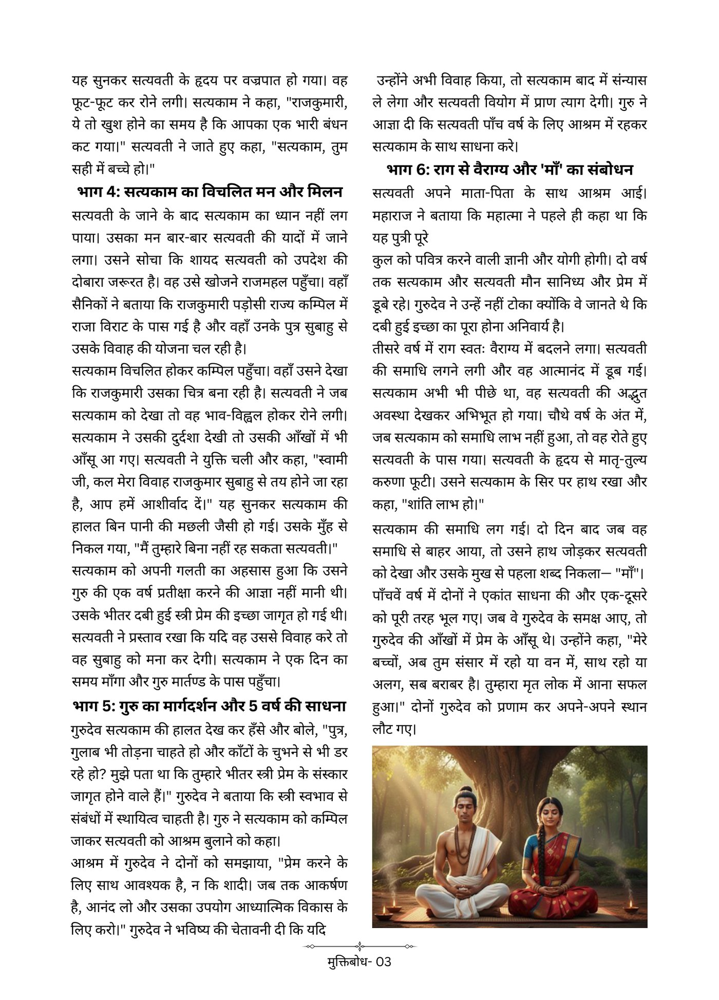

### OCR / Manuscript Text - Page 07

यह सुनकर सत्यवती के हृदय पर वज्रपात हो गया। वह
फूट-फूट कर रोने लगी। सत्यकाम ने कहा, "राजकुमारी,
ये तो खुश होने का समय है कि आपका एक भारी बंधन
कट गया।" सत्यवती ने जाते हुए कहा, "सत्यकाम, तुम
सही में बच्चे हो|"

भाग 4: सत्यकाम का विचलित मन और मिलन
सत्यवती के जाने के बाद सत्यकाम का ध्यान नहीं लग
पाया। उसका मन बार-बार सत्यवती की यादों में जाने
लगा। उसने सोचा कि शायद सत्यवती को उपदेश की
दोबारा जरूरत है। वह उसे खोजने राजमहल पहुँचा। वहाँ
सैनिकों ने बताया कि राजकुमारी पड़ोसी राज्य कम्पिल में
राजा विराट के पास गई है और वहाँ उनके पुत्र सुबाहु से
उसके विवाह की योजना चल रही है।
सत्यकाम विचलित होकर कम्पिल पहुँचा। वहाँ उसने देखा
कि राजकुमारी उसका चित्र बना रही है। सत्यवती ने जब
सत्यकाम को देखा तो वह भाव-विह्लल होकर रोने लगी।
सत्यकाम ने उसकी दुर्दशा देखी तो उसकी आँखों में भी
आँसू आ गए। सत्यवती ने युक्ति चली और कहा, "स्वामी
जी, कल मेरा विवाह राजकुमार सुबाहु से तय होने जा रहा
है, आप हमें आशीर्वाद दें।" यह सुनकर सत्यकाम की
हालत बिन पानी की मछली जैसी हो गई। उसके मुँह से
निकल गया, "मैं तुम्हारे बिना नहीं रह सकता सत्यवती।"
सत्यकाम को अपनी गलती का अहसास हुआ कि उसने
गुरु की एक वर्ष प्रतीक्षा करने की आज्ञा नहीं मानी थी।
उसके भीतर दबी हुई स्त्री प्रेम की इच्छा जागृत हो गई थी।
सत्यवती ने प्रस्ताव रखा कि यदि वह उससे विवाह करे तो
वह सुबाहु को मना कर देगी। सत्यकाम ने एक दिन का
समय माँगा और गुरु मार्तण्ड के पास पहुँचा।
भाग 5: गुरु का मार्गदर्शन और 5 वर्ष की साधना
गुरुदेव सत्यकाम की हालत देख कर Sa और बोले, "पुत्र,
गुलाब भी तोड़ना चाहते हो और काँटों के चुभने से भी डर
रहे हो? मुझे पता था कि तुम्हारे भीतर स्त्री प्रेम के संस्कार
जागृत होने वाले हैं।" गुरुदेव ने बताया कि स्त्री स्वभाव से
संबंधों में स्थायित्व चाहती है। गुरु ने सत्यकाम को कम्पिल
जाकर सत्यवती को आश्रम बुलाने को कहा।
आश्रम में गुरुदेव ने दोनों को समझाया, "प्रेम करने के
लिए साथ आवश्यक है, न कि शादी। जब तक आकर्षण
है, आनंद लो और उसका उपयोग आध्यात्मिक विकास के
लिए करो।" गुरुदेव ने भविष्य की चेतावनी दी कि यदि

उन्होंने अभी विवाह किया, तो सत्यकाम बाद में संन्यास
ले लेगा और सत्यवती वियोग में प्राण त्याग देगी। गुरु ने
आज्ञा दी कि सत्यवती पाँच वर्ष के लिए आश्रम में रहकर
सत्यकाम के साथ साधना करे।

भाग 6: राग से वैराग्य और 'माँ' का संबोधन
सत्यवती अपने माता-पिता के साथ आश्रम आई।
महाराज ने बताया कि महात्मा ने पहले ही कहा था कि
यह पुत्री पूरे
कुल को पवित्र करने वाली ज्ञानी और योगी होगी। दो वर्ष
तक सत्यकाम और सत्यवती मौन सानिध्य और प्रेम में
डूबे रहे। गुरुदेव ने उन्हें नहीं टोका क्योंकि वे जानते थे कि
दबी हुई इच्छा का पूरा होना अनिवार्य है।
तीसरे वर्ष में राग स्वतः वैराग्य में बदलने लगा। सत्यवती
की समाधि लगने लगी और वह आत्मानंद में डूब गई।
सत्यकाम अभी भी पीछे था, वह सत्यवती की अद्भुत
अवस्था देखकर अभिभूत हो गया। चौथे वर्ष के अंत में,
जब सत्यकाम को समाधि लाभ नहीं हुआ, तो वह रोते हुए
सत्यवती के पास गया। सत्यवती के हृदय से मातृ-तुल्य
करुणा फूटी। उसने सत्यकाम के सिर पर हाथ रखा और
कहा, "शांति लाभ etl"
सत्यकाम की समाधि लग गई। दो दिन बाद जब वह
समाधि से बाहर आया, तो उसने हाथ जोड़कर सत्यवती
को देखा और उसके मुख से पहला शब्द निकला- "माँ"।
पाँचवें वर्ष में दोनों ने एकांत साधना की और एक-दूसरे
को पूरी तरह भूल गए। जब वे गुरुदेव के समक्ष आए, तो
गुरुदेव की आँखों में प्रेम के आँसू थे। उन्होंने कहा, "मेरे
बच्चों, अब तुम संसार में रहो या वन में, साथ रहो या
अलग, सब बराबर है। तुम्हारा मृत लोक में आना सफल
हुआ।" दोनों गुरुदेव को प्रणाम कर अपने-अपने स्थान
लौट गए।

2.
oo

er 03

---

## Page 08

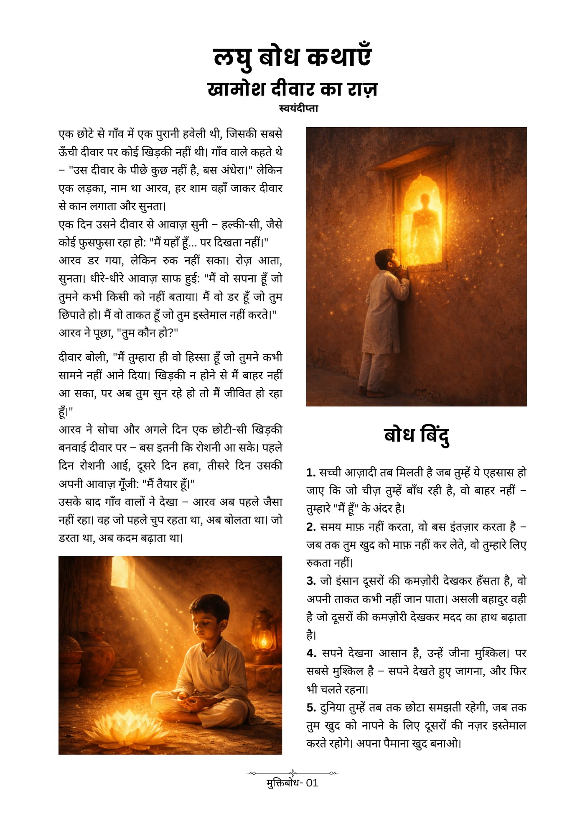

### OCR / Manuscript Text - Page 08

लघु बोध कथाएँ
खामोश दीवार का राज़

स्वयंदीप्ता

एक ole से गाँव में एक पुरानी हवेली थी, जिसकी सबसे
ऊँची दीवार पर कोई खिड़की नहीं थी। गाँव वाले कहते थे
- "उस दीवार के पीछे कुछ नहीं है, बस अंधेरा।" लेकिन
एक लड़का, नाम था आरव, हर शाम वहाँ जाकर दीवार
से कान लगाता और सुनता।

एक दिन उसने दीवार से आवाज़ सुनी - हल्की-सी, जैसे
कोई फुसफुसा रहा हो: "मैं यहाँ हूँ... पर दिखता नहीं।"
आरव डर गया, लेकिन रुक नहीं सका। रोज़ आता,
सुनता। धीरे-धीरे आवाज़ साफ हुई: "मैं वो सपना हूँ जो
तुमने कभी किसी को नहीं बताया। मैं वो डर हूँ जो तुम
छिपाते हो। मैं वो ताकत हूँ जो तुम इस्तेमाल नहीं करते।"
आरव ने पूछा, "तुम कौन हो?"

दीवार बोली, "मैं तुम्हारा ही वो हिस्सा हूँ जो तुमने कभी
सामने नहीं आने fear खिड़की न होने से मैं बाहर नहीं
आ सका, पर अब तुम सुन रहे हो तो मैं जीवित हो रहा
आरव ने सोचा और अगले दिन एक छोटी-सी खिड़की
बनवाई दीवार पर - बस इतनी कि रोशनी आ सके। पहले
दिन रोशनी आई, दूसरे दिन हवा, तीसरे दिन उसकी
अपनी आवाज़ गूँजी: "मैं तैयार gi"

उसके बाद गाँव वालों ने देखा - आरव अब पहले जैसा
नहीं रहा। वह जो पहले चुप रहता था, अब बोलता था। जो
डरता था, अब कदम बढ़ाता था|

बोध बिंदु

1. सच्ची आज़ादी तब मिलती है जब तुम्हें ये एहसास हो
जाए कि जो चीज़ तुम्हें बाँध रही है, वो बाहर नहीं -
तुम्हारे "मै हूँ" के अंदर है।

2. समय माफ़ नहीं करता, वो बस इंतज़ार करता है -
जब तक तुम खुद को माफ़ नहीं कर लेते, वो तुम्हारे लिए
रुकता नहीं।

3. जो इंसान दूसरों की कमज़ोरी देखकर हँसता है, वो
अपनी ताकत कभी नहीं ज्ञान पाता। असली बहादुर वही
है जो दूसरों की कमज़ोरी देखकर मदद का हाथ बढ़ाता
है।

4. सपने देखना आसान है, उन्हें जीना मुश्किल। पर
सबसे मुश्किल है - सपने देखते हुए जागना, और फिर
भी चलते रहना।

5. दुनिया तुम्हें तब तक छोटा समझती रहेगी, जब तक
तुम खुद को नापने के लिए दूसरों की नज़र इस्तेमाल
करते रहोगे। अपना पैमाना खुद बनाओ।

---

## Page 09

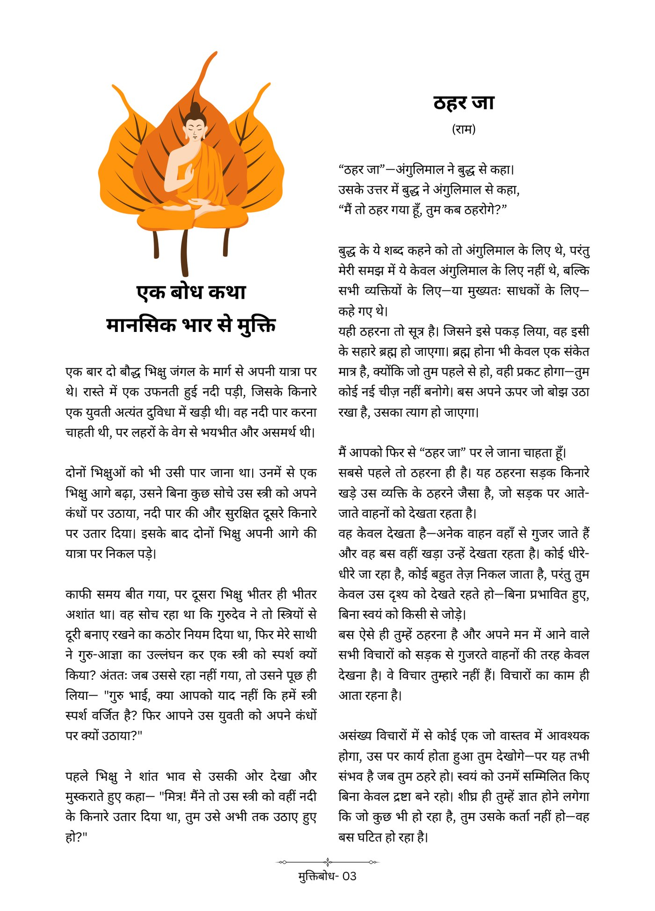

### OCR / Manuscript Text - Page 09

—

एक बोध कथा
मानसिक भार से मुक्ति

एक बार दो बौद्ध भिक्षु जंगल के मार्ग से अपनी यात्रा पर
थे। रास्ते में एक उफनती हुई नदी पड़ी, जिसके किनारे
एक युवती अत्यंत दुविधा में खड़ी थी। वह नदी पार करना
चाहती थी, पर लहरों के वेग से भयभीत और असमर्थ थी।

दोनों भिक्षुओं को भी उसी पार जाना था। उनमें से एक
भिक्षु आगे बढ़ा, उसने बिना कुछ सोचे उस स्त्री को अपने
कंधों पर उठाया, नदी पार की और सुरक्षित दूसरे किनारे
पर उतार दिया। इसके बाद दोनों भिक्षु अपनी आगे की
यात्रा पर निकल पड़े।

काफी समय बीत गया, पर दूसरा भिक्षु भीतर ही भीतर
अशांत था। वह सोच रहा था कि गुरुदेव ने तो स्त्रियों से
दूरी बनाए रखने का कठोर नियम दिया था, फिर मेरे साथी
ने गुरु-आज्ञा का उल्लंघन कर एक स्त्री को स्पर्श क्यों
किया? अंततः जब उससे रहा नहीं गया, तो उसने पूछ ही
लिया- "गुरु भाई, क्या आपको याद नहीं कि हमें स्त्री
स्पर्श वर्जित है? फिर आपने उस युवती को अपने कंधों
पर क्यों उठाया?"

पहले भिक्षु ने शांत भाव से उसकी ओर देखा और
मुस्कराते हुए कहा- "मित्र! मैंने तो उस स्त्री को वहीं नदी
के किनारे उतार दिया था, तुम उसे अभी तक उठाए हुए
हो? "

2.

ठहर जा

(राम)

“ठहर जा”-अंगुलिमाल ने बुद्ध से कहा।
उसके उत्तर में बुद्ध ने अंगुलिमाल से कहा,
“मैं तो ठहर गया हूँ, तुम कब ठहरोगे?”

बुद्ध के ये शब्द कहने को तो अंगुलिमाल के लिए थे, परंतु
मेरी समझ में ये केवल अंगुलिमाल के लिए नहीं थे, बल्कि
सभी व्यक्तियों के लिए-या मुख्यतः साधकों के लिए-
कहे गए थे।

यही ठहरना तो सूत्र है। जिसने इसे पकड़ लिया, वह इसी
के सहारे ब्रह्म हो जाएगा। ब्रह्म होना भी केवल एक संकेत
मात्र है, क्योंकि जो तुम पहले से हो, वही प्रकट होगा-तुम
कोई नई चीज़ नहीं बनोगे। बस अपने ऊपर जो बोझ उठा
रखा है, उसका त्याग हो जाएगा।

मैं आपको फिर से “ठहर जा” पर ले जाना चाहता हूँ।
सबसे पहले तो ठहरना ही है। यह ठहरना सड़क किनारे
खड़े उस व्यक्ति के ठहरने जैसा है, जो सड़क पर आते-
जाते वाहनों को देखता रहता है।

वह केवल देखता है-अनेक वाहन वहाँ से गुजर जाते हैं
और वह बस वहीं खड़ा उन्हें देखता रहता है। कोई धीरे-
धीरे जा रहा है, कोई बहुत तेज़ निकल जाता है, परंतु तुम
केवल उस दृश्य को देखते रहते हो-बिना प्रभावित हुए,
बिना स्वयं को किसी से जोड़े।

बस ऐसे ही तुम्हें ठहरना है और अपने मन में आने वाले
सभी विचारों को सड़क से गुजरते वाहनों की तरह केवल
देखना है। वे विचार Ger नहीं हैं। विचारों का काम ही
आता रहना है।

असंख्य विचारों में से कोई एक जो वास्तव में आवश्यक
होगा, उस पर कार्य होता हुआ तुम देखोगे-पर यह तभी
संभव है जब तुम ठहरे हो। स्वयं को उनमें सम्मिलित किए
बिना केवल द्रष्टा बने रहो। शीघ्र ही तुम्हें ज्ञात होने लगेगा
कि जो कुछ भी हो रहा है, तुम उसके कर्ता नहीं हो-वह
बस घटित हो रहा है।

er 03

---

## Page 10

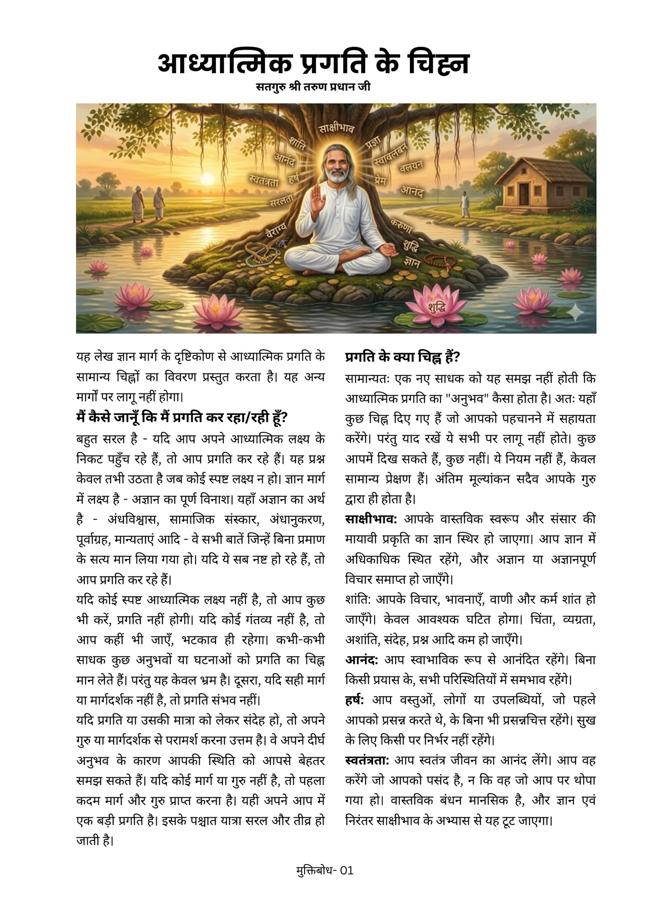

### OCR / Manuscript Text - Page 10

आध्यात्मिक प्रगति के चिह्न

सतगुरु श्री तरुण प्रधान जी

यह लेख ज्ञान मार्ग के दृष्टिकोण से आध्यात्मिक प्रगति के
सामान्य चिल्लो का विवरण प्रस्तुत करता है। यह अन्य
मार्गो पर लागू नहीं होगा।

मैं कैसे जानूँ कि मैं प्रगति कर रहा/रही हूँ?

बहुत सरल है - यदि आप अपने आध्यात्मिक लक्ष्य के
निकट पहुँच रहे हैं, तो आप प्रगति कर रहे हैं। यह प्रश्न
केवल तभी उठता है जब कोई स्पष्ट लक्ष्य न हो। ज्ञान मार्ग
में लक्ष्य है - अज्ञान का पूर्ण विनाश। यहाँ अज्ञान का अर्थ
है - अंधविश्वास, सामाजिक संस्कार, अंधानुकरण,
पूर्वाग्रह, मान्यताएं आदि - वे सभी बातें जिन्हें बिना प्रमाण
के सत्य मान लिया गया हो। यदि ये सब नष्ट हो रहे हैं, तो
आप प्रगति कर रहे हैं।

यदि कोई स्पष्ट आध्यात्मिक लक्ष्य नहीं है, तो आप कुछ
भी करें, प्रगति नहीं होगी। यदि कोई गंतव्य नहीं है, तो
आप कहीं भी जाएँ, भटकाव ही रहेगा। कभी-कभी
साधक कुछ अनुभवों या घटनाओं को प्रगति का चिल्ल
मान लेते हैं। परंतु यह केवल भ्रम है। दूसरा, यदि सही मार्ग
या मार्गदर्शक नहीं है, तो प्रगति संभव नहीं।

यदि प्रगति या उसकी मात्रा को लेकर संदेह हो, तो अपने
गुरु या मार्गदर्शक से परामर्श करना उत्तम है। वे अपने दीर्घ
अनुभव के कारण आपकी स्थिति को आपसे बेहतर
समझ सकते हैं। यदि कोई मार्ग या गुरु नहीं है, तो पहला
कदम मार्ग और गुरु प्राप्त करना है। यही अपने आप में
एक बड़ी प्रगति है। इसके पश्चात यात्रा सरल और तीव्र हो
जाती है।

प्रगति के क्या चिल्ल हैं?

सामान्यतः एक नए साधक को यह समझ नहीं होती कि
आध्यात्मिक प्रगति का "अनुभव" कैसा होता है। अतः यहाँ
कुछ fag दिए गए हैं जो आपको पहचानने में सहायता
करेंगे। परंतु याद रखें ये सभी पर लागू नहीं होते। कुछ
आपमें दिख सकते हैं, कुछ नहीं। ये नियम नहीं हैं, केवल
सामान्य प्रेक्षण हैं। अंतिम मूल्यांकन सदैव आपके गुरु
द्वारा ही होता él

साक्षीभावः आपके वास्तविक स्वरूप और संसार की
मायावी प्रकृति का ज्ञान स्थिर हो जाएगा। आप ज्ञान में
अधिकाधिक स्थित रहेंगे, और अज्ञान या अज्ञानपूर्ण
विचार समाप्त हो जाएँगे।

शांति: आपके विचार, भावनाएँ, वाणी और कर्म शांत हो
जाएंँगे। केवल आवश्यक घटित होगा। चिंता, व्यग्रता,
अशांति, संदेह, प्रश्न आदि कम हो जाएँगे।

आनंदः आप स्वाभाविक रूप से आनंदित रहेंगे। बिना
किसी प्रयास के, सभी परिस्थितियों में समभाव रहेंगे।

हर्षः आप वस्तुओं, लोगों या उपलब्धियों, जो पहले
आपको प्रसन्न करते थे, के बिना भी प्रसन्नचित्त रहेंगे। सुख
के लिए किसी पर निर्भर नहीं रहेंगे।

स्वतंत्रता: आप स्वतंत्र जीवन का आनंद लेंगे। आप वह
करेंगे जो आपको पसंद है, न कि वह जो आप पर थोपा
गया हो। वास्तविक बंधन मानसिक है, और ज्ञान एवं
निरंतर साक्षीभाव के अभ्यास से यह टूट जाएगा।

मुक्तिबोध- 01

---

## Page 11

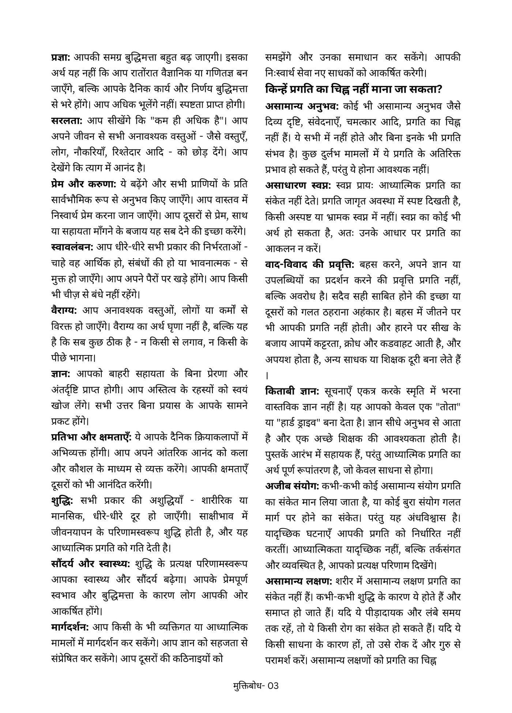

### OCR / Manuscript Text - Page 11

प्रज्ञाः आपकी समग्र बुद्धिमत्ता बहुत बढ़ जाएगी। इसका
अर्थ यह नहीं कि आप रातोरात वैज्ञानिक या गणितज्ञ बन
जाएँगे, बल्कि आपके दैनिक कार्य और निर्णय बुद्धिमत्ता
से भरे होंगे। आप अधिक भूलेंगे नहीं। स्पष्टता प्राप्त होगी।
सरलता: आप सीखेंगे कि "कम ही अधिक है"। आप
अपने जीवन से सभी अनावश्यक वस्तुओं - जैसे वस्तुएँ,
लोग, नौकरियाँ, रिश्तेदार आदि - को छोड़ a) आप
देखेंगे कि त्याग में आनंद है।

प्रेम और करुणा: ये बढ़ेंगे और सभी प्राणियों के प्रति
सार्वभौमिक रूप से अनुभव किए जाएँगे। आप वास्तव में
निस्वार्थ प्रेम करना ज्ञान जाएँगे। आप दूसरों से प्रेम, साथ
या सहायता माँगने के बजाय यह सब देने की इच्छा करेंगे।
स्वावलंबन: आप धीरे-धीरे सभी प्रकार की निर्भरताओं -
चाहे वह आर्थिक हो, संबंधों की हो या भावनात्मक - से
मुक्त हो जाएँगे। आप अपने पैरों पर खड़े होंगे। आप किसी
भी चीज़ से बंधे नहीं रहेंगे।

वैराग्यः आप अनावश्यक वस्तुओं, लोगों या कर्मो से
विरक्त हो जाएँगे। वैराग्य का अर्थ घृणा नहीं है, बल्कि यह
है कि सब कुछ ठीक है - न किसी से लगाव, न किसी के
पीछे भागना।

ज्ञानः आपको बाहरी सहायता के बिना प्रेरणा और
अंतर्दष्टि प्राप्त होगी। आप अस्तित्व के रहस्यों को स्वयं
खोज लेंगे। सभी उत्तर बिना प्रयास के आपके सामने
प्रकट होंगे।

प्रतिभा और क्षमताएँ: ये आपके दैनिक क्रियाकलापों में
अभिव्यक्त होंगी। आप अपने आंतरिक आनंद को कला
और कौशल के माध्यम से व्यक्त करेंगे। आपकी क्षमताएँ
दूसरों को भी आनंदित करेंगी।

शुद्धिः सभी प्रकार की अशुद्धियाँ - शारीरिक या
मानसिक, धीरे-धीरे दूर हो जाएँगी। साक्षीभाव में
जीवनयापन के परिणामस्वरूप शुद्धि होती है, और यह
आध्यात्मिक प्रगति को गति देती है।

सौंदर्य और स्वास्थ्य: शुद्धि के प्रत्यक्ष परिणामस्वरूप
आपका स्वास्थ्य और सौंदर्य बढ़ेगा। आपके प्रेमपूर्ण
स्वभाव और बुद्धिमत्ता के कारण लोग आपकी ओर
आकर्षित होंगे।

मार्गदर्शन: आप किसी के भी व्यक्तिगत या आध्यात्मिक
मामलों में मार्गदर्शन कर सकेंगे। आप ज्ञान को सहजता से
संप्रेषित कर सकेंगे। आप दूसरों की कठिनाइयों को

समझेंगे और उनका समाधान कर सकेंगे। आपकी
निःस्वार्थ सेवा नए साधकों को आकर्षित करेगी।

किन्हें प्रगति का fae नहीं माना जा सकता?
असामान्य अनुभवः कोई भी असामान्य अनुभव जैसे
दिव्य दृष्टि, संवेदनाएँ, चमत्कार आदि, प्रगति का चिल्ल
नहीं हैं। ये सभी में नहीं होते और बिना इनके भी प्रगति
संभव है। कुछ दुर्लभ मामलों में ये प्रगति के अतिरिक्त
प्रभाव हो सकते हैं, परंतु ये होना आवश्यक नहीं।
असाधारण स्वप्नः स्वप्न प्रायः आध्यात्मिक प्रगति का
संकेत नहीं देते। प्रगति जागृत अवस्था में स्पष्ट दिखती है,
किसी अस्पष्ट या भ्रामक स्वप्न में नहीं। स्वप्र का कोई भी
अर्थ हो सकता है, अतः उनके आधार पर प्रगति का
आकलन न करें।

वाद-विवाद की प्रवृत्तिः बहस करने, अपने ज्ञान या
उपलब्धियों का प्रदर्शन करने की प्रवृत्ति प्रगति नहीं,
बल्कि अवरोध है। सदैव सही साबित होने की इच्छा या
दूसरों को गलत ठहराना अहंकार है। बहस में जीतने पर
भी आपकी प्रगति नहीं होती। और हारने पर सीख के
बजाय आपमें कट्टरता, क्रोध और कडवाहट आती है, और
अपयश होता है, अन्य साधक या शिक्षक दूरी बना लेते हैं
|

किताबी ज्ञान: सूचनाएँ एकत्र करके स्मृति में भरना
वास्तविक ज्ञान नहीं है। यह आपको केवल एक "तोता"
या "हार्ड ड्राइव" बना देता है। ज्ञान सीधे अनुभव से आता
है और एक अच्छे शिक्षक की आवश्यकता होती है।
पुस्तकें आरंभ में सहायक हैं, परंतु आध्यात्मिक प्रगति का
अर्थ पूर्ण रूपांतरण है, जो केवल साधना से होगा।

अजीब संयोग: कभी-कभी कोई असामान्य संयोग प्रगति
का संकेत मान लिया जाता है, या कोई बुरा संयोग गलत
मार्ग पर होने का संकेत। परंतु यह अंधविश्वास है।
यादृच्छिक घटनाएँ आपकी प्रगति को निर्धारित नहीं
करतीं। आध्यात्मिकता यादृच्छिक नहीं, बल्कि तर्कसंगत
और व्यवस्थित है, आपको प्रत्यक्ष परिणाम दिखेंगे।
असामान्य लक्षणः शरीर में असामान्य लक्षण प्रगति का
संकेत नहीं हैं। कभी-कभी शुद्धि के कारण ये होते हैं और
समाप्त हो जाते हैं। यदि ये पीड़ादायक और लंबे समय
तक रहें, तो ये किसी रोग का संकेत हो सकते हैं। यदि ये
किसी साधना के कारण हों, तो उसे रोक दें और गुरु से
परामर्श करें। असामान्य लक्षणों को प्रगति का चिह्न

मुक्तिबोध- 03

---

## Page 12

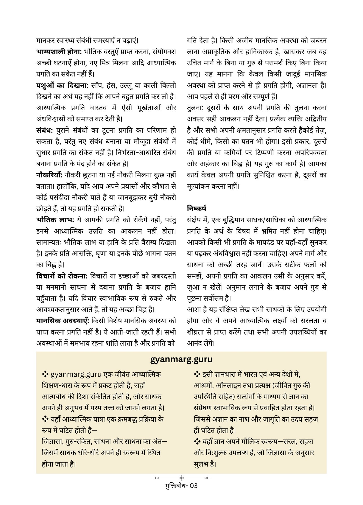

### OCR / Manuscript Text - Page 12

मानकर स्वास्थ्य संबंधी समस्याएँ न बढ़ाएं।

भाग्यशाली होना: भौतिक वस्तुएँ प्राप्त करना, संयोगवश
अच्छी घटनाएँ होना, नए मित्र मिलना आदि आध्यात्मिक
प्रगति का संकेत नहीं हैं।

पशुओं का दिखना: साँप, हंस, उल्लू या काली बिल्ली
दिखने का अर्थ यह नहीं कि आपने बहुत प्रगति कर ली है।
आध्यात्मिक प्रगति वास्तव में ऐसी मूर्खताओं और
अंधविश्वासों को समाप्त कर देती है।

संबंधः पुराने संबंधों का टूटना प्रगति का परिणाम हो
सकता है, परंतु नए संबंध बनाना या मौजूदा संबंधों में
सुधार प्रगति का संकेत नहीं है। निर्भरता-आधारित संबंध
बनाना प्रगति के मंद होने का संकेत है।

नौकरियाँ: नौकरी छूटना या नई नौकरी मिलना कुछ नहीं
बताता। हालाँकि, यदि आप अपने प्रयासों और कौशल से
कोई पसंदीदा नौकरी पाते हैं या जानबूझकर बुरी नौकरी
छोड़ते हैं, तो यह प्रगति हो सकती है।

भौतिक लाभः ये आपकी प्रगति को रोकेंगे नहीं, परंतु
इनसे आध्यात्मिक उन्नति का आकलन नहीं होता।
सामान्यतः भौतिक लाभ या हानि के प्रति वैराग्य दिखता
है। इनके प्रति आसक्ति, घृणा या इनके पीछे भागना पतन
का चिल्ल él

विचारों को रोकना: विचारों या इच्छाओं को जबरदस्ती
या मनमानी साधना से दबाना प्रगति के बजाय हानि
पहुँचाता है। यदि विचार स्वाभाविक रूप से रुकते और
आवश्यकतानुसार आते हैं, तो यह अच्छा चिल्ल है।
मानसिक अवस्थाएँ: किसी विशेष मानसिक अवस्था को
प्राप्त करना प्रगति नहीं है। ये आती-जाती रहती हैं। सभी
अवस्थाओं में समभाव रहना शांति लाता है और प्रगति को

गति देता है। किसी अजीब मानसिक अवस्था को जबरन
लाना अप्राकृतिक और हानिकारक है, खासकर जब यह
उचित मार्ग के बिना या गुरु से परामर्श किए बिना किया
जाए। यह मानना कि केवल किसी जादुई मानसिक
अवस्था को प्राप्त करने से ही प्रगति होगी, अज्ञानता है।
आप पहले से ही परम और सम्पूर्ण हैं।

तुलना: दूसरों के साथ अपनी प्रगति की तुलना करना
अक्सर सही आकलन नहीं देता। प्रत्येक व्यक्ति अद्वितीय
है और सभी अपनी क्षमतानुसार प्रगति करते हैंकोई तेज़,
कोई धीमे, किसी का पतन भी होगा। इसी प्रकार, दूसरों
की प्रगति या कमियों पर टिप्पणी करना अपरिपक्वता
और अहंकार का चिल्ल है। यह गुरु का कार्य Vl आपका
कार्य केवल अपनी प्रगति सुनिश्चित करना है, दूसरों का
मूल्यांकन करना नहीं।

निष्कर्ष

संक्षेप में, एक बुद्धिमान साधक/साधिका को आध्यात्मिक
प्रगति के अर्थ के विषय में भ्रमित नहीं होना चाहिए।
आपको किसी भी प्रगति के मापदंड पर यहाँ-वहाँ सुनकर
या पढ़कर अंधविश्वास नहीं करना चाहिए। अपने मार्ग और
साधना को अच्छी तरह जानें। उसके सटीक फलों को
समझें, अपनी प्रगति का आकलन उसी के अनुसार करें,
जुआ न खेलें। अनुमान लगाने के बजाय अपने गुरु से
पूछना सर्वोत्तम है।

आशा है यह संक्षिप्त लेख सभी साधकों के लिए उपयोगी
होगा और वे अपने आध्यात्मिक लक्ष्यों को सरलता व
शीघ्रता से प्राप्त करेंगे तथा सभी अपनी उपलब्धियों का
आनंद लेंगे।

gyanmarg.guru

+° gyanmarg.guru एक जीवंत आध्यात्मिक
शिक्षण-धारा के रूप में प्रकट होती है, जहाँ
आत्मबोध की दिशा संकेतित होती है, और साधक
अपने ही अनुभव में परम तत्त्व को जानने लगता है।
*%* यहाँ आध्यात्मिक यात्रा एक क्रमबद्ध प्रक्रिया के
रूप में घटित होती है-

जिज्ञासा, गुरु-संकेत, साधना और साधना का अंत-
जिसमें साधक धीरे-धीरे अपने ही स्वरूप में स्थित
होता जाता है।

%* इसी ज्ञानधारा में भारत एवं अन्य देशों में,
आश्रमों, ऑनलाइन तथा प्रत्यक्ष (जीवित गुरु की
उपस्थिति सहित) सत्संगों के माध्यम से ज्ञान का
संप्रेषण स्वाभाविक रूप से प्रवाहित होता रहता है।
जिससे अज्ञान का नाश और जागृति का उदय सहज
ही घटित होता है।

%* यहाँ ज्ञान अपने मौलिक स्वरूप-सरल, सहज
और निःशुल्क उपलब्ध है, जो जिज्ञासा के अनुसार
सुलभ है।

2.

er 03

---

## Page 13

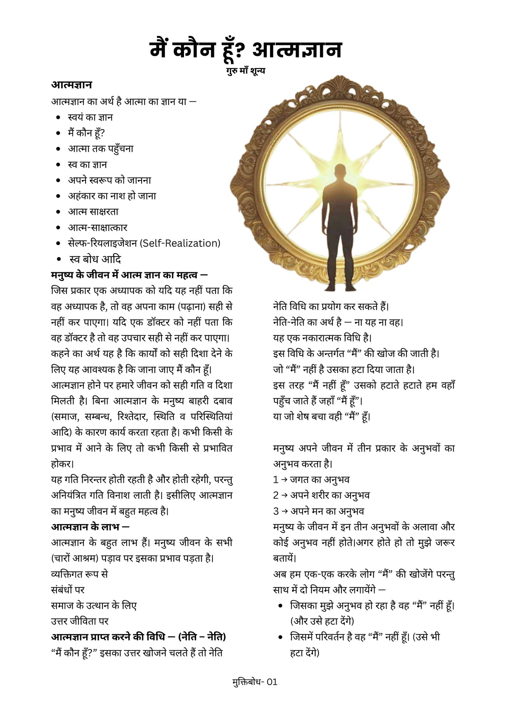

### OCR / Manuscript Text - Page 13

मैं कौन हूँ? आत्मज्ञान

गुरु माँ शून्य

आत्मज्ञान
आत्मज्ञान का अर्थ है आत्मा का ज्ञान या -

स्वयं का ज्ञान

* मैं कौन हूँ?

* आत्मा तक पहुँचना

° स्व काज्ञान

® अपने स्वरूप को जानना

® अहंकार का नाश हो जाना

© आत्म साक्षरता

© आत्म-साक्षात्कार

e सेल्फ-रियलाइजेशन (Self-Realization)

* स्व बोध आदि
मनुष्य के जीवन में आत्म ज्ञान का महत्व —
जिस प्रकार एक अध्यापक को यदि यह नहीं पता कि
वह अध्यापक है, तो वह अपना काम (पढ़ाना) सही से
नहीं कर पाएगा। यदि एक डॉक्टर को नहीं पता कि
वह डॉक्टर है तो वह उपचार सही से नहीं कर पाएगा।
कहने का अर्थ यह है कि कायां को सही दिशा देने के
लिए यह आवश्यक है कि जाना जाए मैं कौन हूँ।
आत्मज्ञान होने पर हमारे जीवन को सही गति व दिशा
मिलती है। बिना आत्मज्ञान के मनुष्य बाहरी दबाव
(समाज, सम्बन्ध, रिश्तेदार, स्थिति व परिस्थितियां
आदि) के कारण कार्य करता रहता है। कभी किसी के
प्रभाव में आने के लिए तो कभी किसी से प्रभावित
होकर।
यह गति निरन्तर होती रहती है और होती रहेगी, परन्तु
अनियंत्रित गति विनाश लाती है। इसीलिए आत्मज्ञान
का मनुष्य जीवन में बहुत महत्व है।
आत्मज्ञान के लाभ —
आत्मज्ञान के बहुत लाभ हैं। मनुष्य जीवन के सभी
(चारों आश्रम) पड़ाव पर इसका प्रभाव पड़ता है।
व्यक्तिगत रूप से
संबंधों पर
समाज के उत्थान के लिए
उत्तर जीविता पर
आत्मज्ञान प्राप्त करने की विधि - (नेति - नेति)
“मैं कौन हूँ?” इसका उत्तर खोजने चलते हैं तो नेति

नेति विधि का प्रयोग कर सकते हैं।

नेति-नेति का अर्थ है — ना यह ना वह।

यह एक नकारात्मक विधि है।

इस विधि के अन्तर्गत “मैं” की खोज की जाती है।

जो “मैं” नहीं है उसका हटा दिया जाता है।

इस तरह “मैं नहीं हूँ” उसको हटाते हटाते हम वहाँ
पहुँच जाते हैं जहाँ “मैं हूँ”।

या जो शेष बचा वही “मै” हूँ।

मनुष्य अपने जीवन में तीन प्रकार के अनुभवों का
अनुभव करता है।
1 &gt; जगत का अनुभव
2 &gt; अपने शरीर का अनुभव
3 ¬&gt; अपने मन का अनुभव
मनुष्य के जीवन में इन तीन अनुभवों के अलावा और
कोई अनुभव नहीं होते।अगर होते हो तो मुझे जरूर
बतायें।
अब हम एक-एक करके लोग “मैं” की खोजेंगे परन्तु
साथ में दो नियम और लगायेंगे -
* जिसका मुझे अनुभव हो रहा है वह “मैं” नहीं हूँ।
(और उसे हटा देंगे)
* जिसमें परिवर्तन है वह “मैं” नहीं हूँ। (उसे भी
हटा देंगे)

मुक्तिबोध- 01

---

## Page 14

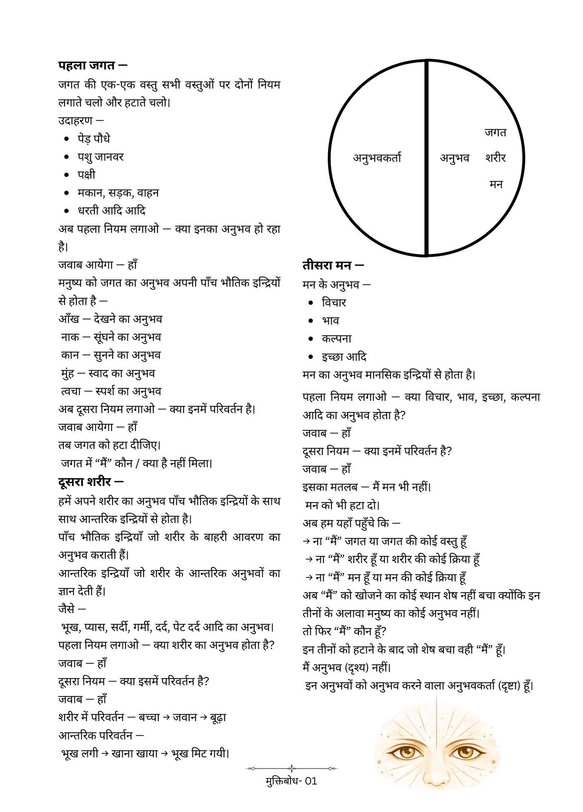

### OCR / Manuscript Text - Page 14

पहला जगत —
जगत की एक-एक वस्तु सभी वस्तुओं पर दोनों नियम
लगाते चलो और हटाते चलो।

उदाहरण —
+ पेड़ पौधे 3
* पशु जानवर अनुभव शरीर
° पक्षी

मन

* मकान, सड़क, वाहन
« धरती आदि आदि
अब पहला नियम लगाओ - क्या इनका अनुभव हो रहा

है।

जवाब आयेगा - हाँ तीसरा मन -

मनुष्य को जगत का अनुभव अपनी पाँच भौतिक इन्द्रियों मन के अनुभव —

से होता है - e विचार

आँख - देखने का अनुभव ° भाव

नाक — सूंघने का अनुभव © कल्पना

कान - सुनने का अनुभव e इच्छा आदि

मुंह — स्वाद का अनुभव मन का अनुभव मानसिक इन्द्रियों से होता है।

त्वचा - स्पर्श का अनुभव
अब दूसरा नियम लगाओ - क्या इनमें परिवर्तन है।
जवाब आयेगा - हाँ

पहला नियम लगाओ — क्या विचार, भाव, इच्छा, कल्पना
आदि का अनुभव होता है?

जवाब - हाँ
तब जगत को हटा दीजिए। दूसरा नियम — क्या इनमें परिवर्तन है?
जगत में “मैं” कौन / क्या है नहीं मिला। जवाब - हाँ
दूसरा शरीर — इसका मतलब - मैं मन भी नहीं।
हमें अपने शरीर का अनुभव पाँच भौतिक इन्द्रियों के साथ मनको भी हटा दो।
साथ आन्तरिक इन्द्रियों से होता है। अब हम यहाँ पहुँचे कि -
पाँच भौतिक इन्ट्रियाँ जो शरीर के बाहरी आवरण का  ना“मैं” जगत या जगत की कोई वस्तु हूँ
अनुभव कराती हैं। &gt; ना “मैं” शरीर हूँ या शरीर की कोई क्रिया हूँ
आन्तरिक इन्द्रियाँ जो शरीर के आन्तरिक अनुभवों का नामै” मन हूँ या मन की कोई क्रिया हूँ
ज्ञान देती हैं। अब “मैं” को खोजने का कोई स्थान शेष नहीं बचा क्योंकि इन
जैसे - तीनों के अलावा मनुष्य का कोई अनुभव नहीं।

भूख, प्यास, सर्दी, गर्मी, दर्द, पेट दर्द आदि का अनुभव। तो फिर “मैं” कौन हूँ?
पहला नियम लगाओ - वया शरीर का अनुभव होता है? इन तीनों को हटाने के बाद जो शेष बचा वही “मैं” हूँ

जवाब - हाँ म मैं अनुभव (दृश्य) नहीं।
दूसरा नियम — क्या इसमें परिवर्तन है? इन अनुभवों को अनुभव करने वाला अनुभवकर्ता (दष्ट) हूँ।
जवाब - हाँ
शरीर में परिवर्तन - बच्चा &gt; जवान &gt; बूढ़ा \
आन्तरिक परिवर्तन - SO Jae.
भूख लगी &gt; खाना खाया &gt; भूख मिट गयी। : ल्के क्क ”

2. a
oo . ~

---

## Page 15

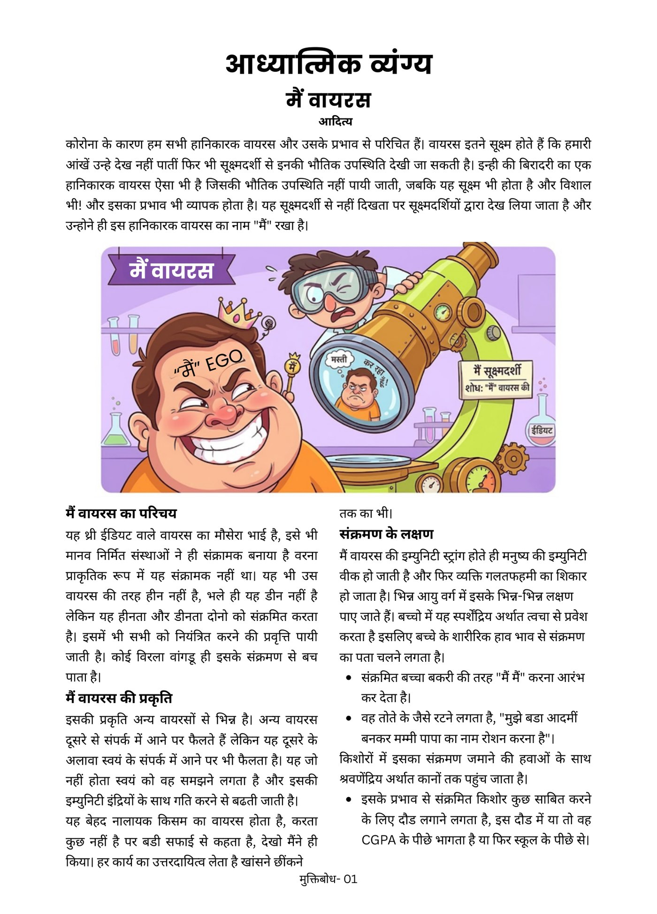

### OCR / Manuscript Text - Page 15

आध्यात्मिक व्यंग्य
मैं वायरस

आदित्य

कोरोना के कारण हम सभी हानिकारक वायरस और उसके प्रभाव से परिचित हैं। वायरस इतने सूक्ष्म होते हैं कि हमारी
आंखें उन्हे देख नहीं पातीं फिर भी सूक्ष्मदर्शी से इनकी भौतिक उपस्थिति देखी जा सकती है। इन्ही की बिरादरी का एक
हानिकारक वायरस ऐसा भी है जिसकी भौतिक उपस्थिति नहीं पायी जाती, जबकि यह सूक्ष्म भी होता है और विशाल
भी! और इसका प्रभाव भी व्यापक होता है। यह सूक्ष्मदर्शी से नहीं दिखता पर सूक्ष्मदर्शियों द्वारा देख लिया जाता है और

उन्होने ही इस हानिकारक वायरस का नाम "मैं" रखा है।

मैं वायरस का परिचय

यह of ईडियट वाले वायरस का मौसेरा भाई है, इसे भी
मानव निर्मित संस्थाओं ने ही संक्रामक बनाया है वरना
प्राकृतिक रूप में यह संक्रामक नहीं था। यह भी उस
वायरस की तरह हीन नहीं है, भले ही यह डीन नहीं है
लेकिन यह हीनता और डीनता दोनो को संक्रमित करता
है। इसमें भी सभी को नियंत्रित करने की प्रवृत्ति पायी
जाती है। कोई विरला वांगडू ही इसके संक्रमण से बच
पाता है।

मैं वायरस की प्रकृति

इसकी प्रकृति अन्य वायरसों से भिन्न है। अन्य वायरस
दूसरे से संपर्क में आने पर फैलते हैं लेकिन यह दूसरे के
अलावा स्वयं के संपर्क में आने पर भी फैलता है। यह जो
नहीं होता स्वयं को वह समझने लगता है और इसकी
इम्युनिटी इंद्रियों के साथ गति करने से बढती जाती है।

यह बेहद नालायक किसम का वायरस होता है, करता
कुछ नहीं है पर बडी सफाई से कहता है, देखो मैंने ही
किया। हर कार्य का उत्तरदायित्व लेता है खांसने छींकने

तक का भी।
संक्रमण के लक्षण
मैं वायरस की इम्युनिटी स्ट्रांग होते ही मनुष्य की इम्युनिटी
वीक हो जाती है और फिर व्यक्ति गलतफहमी का शिकार
हो जाता है। भिन्न आयु वर्ग में इसके भिन्न-भिन्न लक्षण
पाए जाते हैं। बच्चो में यह स्पर्शोद्रिय अर्थात त्वचा से प्रवेश
करता है इसलिए बच्चे के शारीरिक हाव भाव से संक्रमण
का पता चलने लगता है।
® संक्रमित बच्चा बकरी की तरह "मैं मैं" करना आरंभ
कर देता है।
* वह तोते के जैसे रटने लगता है, "मुझे बडा आदमीं
बनकर मम्मी पापा का नाम रोशन करना है"।
किशोरों में इसका संक्रमण जमाने की हवाओं के साथ
श्रवणेंद्रिय अर्थात कानों तक पहुंच जाता है।
१ इसके प्रभाव से संक्रमित किशोर कुछ साबित करने
के लिए दौड लगाने लगता है, इस दौड में या तो वह
CGPA के पीछे भागता है या फिर स्कूल के पीछे से।

मुक्तिबोध- 01

---

## Page 16

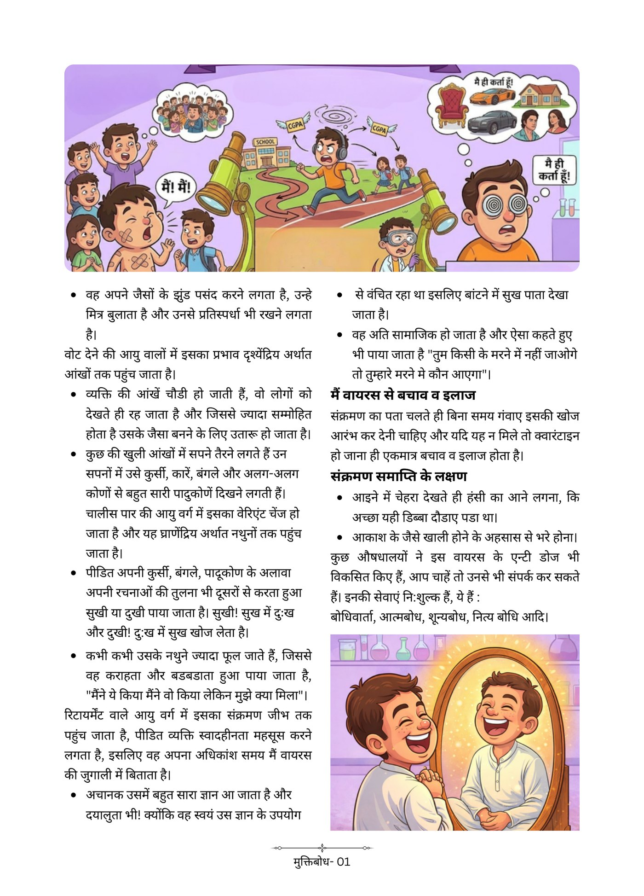

### OCR / Manuscript Text - Page 16

१ वह अपने जैसों के झुंड पसंद करने लगता है, FS
मित्र बुलाता है और उनसे प्रतिस्पर्धा भी रखने लगता
है।

वोट देने की आयु वालों में इसका प्रभाव दृश्येंद्रिय अर्थात
आंखों तक पहुंच जाता है।

* व्यक्ति की आंखें चौड़ी हो जाती हैं, वो लोगों को
देखते ही रह जाता है और जिससे ज्यादा सम्मोहित
होता है उसके जैसा बनने के लिए उतारू हो जाता है।

* कुछ की खुली आंखों में सपने तैरने लगते हैं उन
सपनों में उसे कुर्सी, कारें, बंगले और अलग-अलग
कोणों से बहुत सारी पादुकोणें दिखने लगती हैं।
चालीस पार की आयु वर्ग में इसका वेरिएंट चेंज हो
जाता है और यह घ्ाणेंद्रिय अर्थात नथुनों तक पहुंच
जाता है।

* पीडित अपनी कुर्सी, बंगले, पादूकोण के अलावा
अपनी रचनाओं की तुलना भी दूसरों से करता हुआ
सुखी या दुखी पाया जाता है। सुखी! सुख में दुःख
और दुखी! दुःख में सुख खोज लेता है।

१ कभी कभी उसके नथुने ज्यादा फूल जाते हैं, जिससे
वह कराहता और बडबडाता हुआ पाया जाता है,
"मैंने ये किया मैंने वो किया लेकिन मुझे क्या मिला"।

रिटायरमेंट वाले आयु वर्ग में इसका संक्रमण जीभ तक
पहुंच जाता है, पीडित व्यक्ति स्वादहीनता महसूस करने
लगता है, इसलिए वह अपना अधिकांश समय मैं वायरस
की जुगाली में बिताता है।

© अचानक उसमें बहुत सारा ज्ञान आ जाता है और
दयालुता भी! क्योंकि वह स्वयं उस ज्ञान के उपयोग

ot.

* से वंचित रहा था इसलिए बांटने में सुख पाता देखा
जाता है।
© वह अति सामाजिक हो जाता है और ऐसा कहते हुए
भी पाया जाता है "तुम किसी के मरने में नहीं जाओगे
तो तुम्हारे मरने मे कौन आएगा"।
मैं वायरस से बचाव व इलाज
संक्रमण का पता चलते ही बिना समय गंवाए इसकी खोज
आरंभ कर देनी चाहिए और यदि यह न मिले तो क्वारंटाइन
हो जाना ही एकमात्र बचाव व इलाज होता है।
संक्रमण समाप्ति के लक्षण
e आइने में चेहरा देखते ही हंसी का आने लगना, कि
अच्छा यही डिब्बा दौडाए पडा था।
आकाश के जैसे खाली होने के अहसास से भरे होना।
कुछ औषधालयों ने इस वायरस के एन्टी डोज भी
विकसित किए हैं, आप चाहें तो उनसे भी संपर्क कर सकते
हैं। इनकी सेवाएं नि:शुल्क हैं, ये हैं :
बोधिवार्ता, आत्मबोध, शून्यबोध, नित्य बोधि आदि।

क

2.

a )
मुक्तिबोध- 01

---

## Page 17

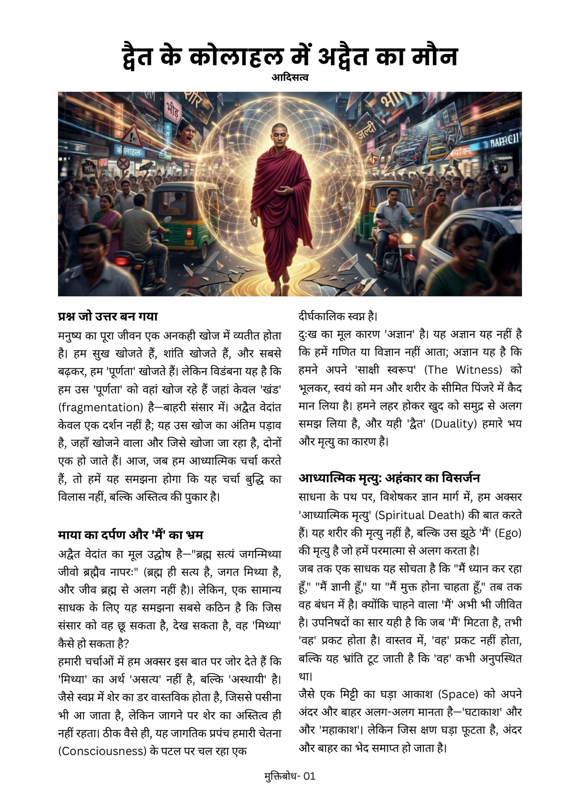

### OCR / Manuscript Text - Page 17

द्वैत के कोलाहल में अद्वैत का मौन

आदिसत्व

प्रश्न जो उत्तर बन गया

मनुष्य का पूरा जीवन एक अनकही खोज में व्यतीत होता
है। हम सुख खोजते हैं, शांति खोजते हैं, और सबसे
बढ़कर, हम 'पूर्णता' खोजते हैं। लेकिन विडंबना यह है कि
हम उस 'पूर्णता' को वहां खोज रहे हैं जहां केवल 'खंड'
(fragmentation) है~वबाहरी संसार Al अद्वैत वेदांत
केवल एक दर्शन नहीं है; यह उस खोज का अंतिम पड़ाव
है, जहाँ खोजने वाला और जिसे खोजा जा रहा है, दोनों
एक हो जाते हैं। आज, जब हम आध्यात्मिक चर्चा करते
हैं, तो हमें यह समझना होगा कि यह चर्चा बुद्धि का
विलास नहीं, बल्कि अस्तित्व की पुकार है।

माया का दर्पण और 'मैं' का भ्रम

अद्वैत वेदांत का मूल उद्घोष है-"ब्रह्म सत्यं जगन्मिथ्या
जीवो ब्रह्मैव नापरः" (ब्रह्म ही सत्य है, जगत मिथ्या है,
और जीव ब्रह्म से अलग नहीं है)। लेकिन, एक सामान्य
साधक के लिए यह समझना सबसे कठिन है कि जिस
संसार को वह छू सकता है, देख सकता है, वह 'मिथ्या'
कैसे हो सकता है?

हमारी चर्चाओं में हम अक्सर इस बात पर जोर देते हैं कि
‘ea का अर्थ 'असत्य' नहीं है, बल्कि 'अस्थायी' है।
जैसे xan में शेर का डर वास्तविक होता है, जिससे पसीना
भी आ जाता है, लेकिन जागने पर शेर का अस्तित्व ही
नहीं रहता। ठीक वैसे ही, यह जागतिक प्रपंच हमारी चेतना
(Consciousness) के पटल पर चल रहा एक

दीर्घकालिक स्वप्न है।

दुःख का मूल कारण 'अज्ञान' है। यह अज्ञान यह नहीं है
कि हमें गणित या विज्ञान नहीं आता; अज्ञान यह है कि
हमने अपने 'साक्षी स्वरूप' (The Witness) को
भूलकर, स्वयं को मन और शरीर के सीमित पिंजरे में कैद
मान लिया है। हमने लहर होकर खुद को समुद्र से अलग
समझ लिया है, और यही 'द्वैत' (Duality) हमारे भय
और मृत्यु का कारण है।

आध्यात्मिक मृत्युः अहंकार का विसर्जन

साधना के पथ पर, विशेषकर ज्ञान मार्ग में, हम अक्सर
'आध्यात्मिक मृत्यु' (Spiritual Death) की बात करते
हैं। यह शरीर की मृत्यु नहीं है, बल्कि उस झूठे 'मैं' (६६0)
की मृत्यु है जो हमें परमात्मा से अलग करता है।

जब तक एक साधक यह सोचता है कि "मैं ध्यान कर रहा
हूँ," "मैं ज्ञानी हूँ," या "मैं मुक्त होना चाहता हूँ," तब तक
वह बंधन में है। क्योंकि चाहने वाला 'मैं' अभी भी जीवित
है। उपनिषदों का सार यही है कि जब 'मैं' मिटता है, तभी
'वह' प्रकट होता है। वास्तव में, 'वह' प्रकट नहीं होता,
बल्कि यह भ्रांति टूट जाती है कि 'वह' कभी अनुपस्थित
था।

जैसे एक मिट्टी का घड़ा आकाश (Space) को अपने
अंदर और बाहर अलग-अलग मानता है-'घटाकाश' और
और 'महाकाश'। लेकिन जिस क्षण घड़ा Heal है, अंदर
और बाहर का भेद समाप्त हो जाता है।

मुक्तिबोध- 01

---

## Page 18

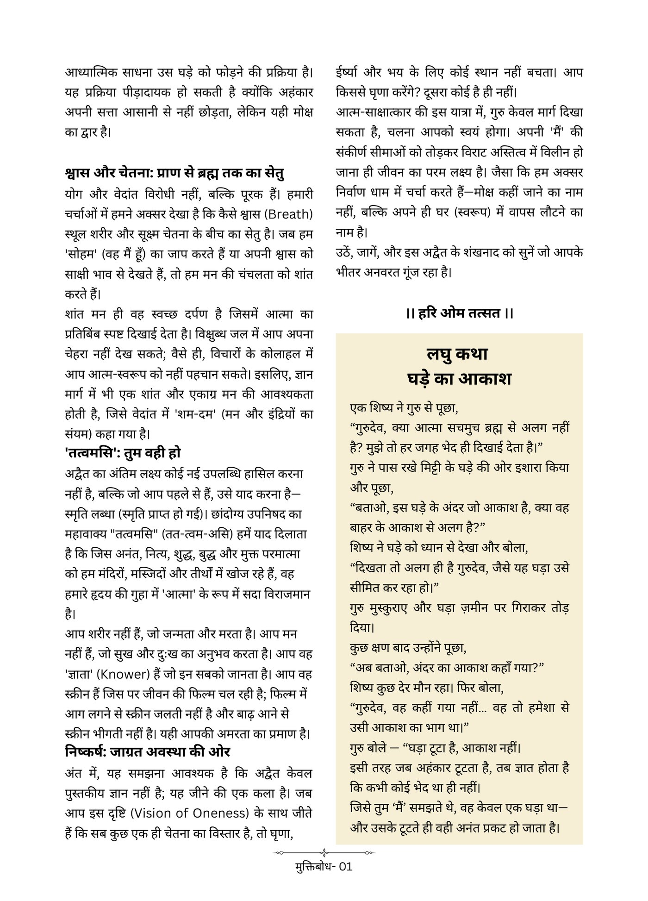

### OCR / Manuscript Text - Page 18

आध्यात्मिक साधना उस घड़े को फोड़ने की प्रक्रिया है।
यह प्रक्रिया पीड़ादायक हो सकती है क्योंकि अहंकार
अपनी सत्ता आसानी से नहीं छोड़ता, लेकिन यही मोक्ष
का द्वार है।

श्वास और चेतनाः: प्राण से ब्रह्म तक का सेतु

योग और वेदांत विरोधी नहीं, बल्कि पूरक हैं। हमारी
चर्चाओं में हमने अक्सर देखा है कि कैसे श्वास (Breath)
स्थूल शरीर और सूक्ष्म चेतना के बीच का सेतु है। जब हम
'सोहम' (वह मैं हूँ) का जाप करते हैं या अपनी श्वास को
साक्षी भाव से देखते हैं, तो हम मन की चंचलता को शांत
करते हैं।

शांत मन ही वह स्वच्छ दर्पण है जिसमें आत्मा का
प्रतिबिंब स्पष्ट दिखाई देता है। विक्षुब्ध जल में आप अपना
चेहरा नहीं देख सकते; वैसे ही, विचारों के कोलाहल में
आप आत्म-स्वरूप को नहीं पहचान सकते। इसलिए, ज्ञान
मार्ग में भी एक शांत और एकाग्र मन की आवश्यकता
होती है, जिसे वेदांत में 'शम-दम' (मन और इंद्रियों का
संयम) कहा गया है।

'तत्वमसि': तुम वही हो

अद्वैत का अंतिम लक्ष्य कोई नई उपलब्धि हासिल करना
नहीं है, बल्कि जो आप पहले से हैं, उसे याद करना है-
स्मृति लब्धा (स्मृति प्राप्त हो गई)। छांदोग्य उपनिषद का
महावाक्य "तत्वमसि" (तत-त्वम-असि) हमें याद दिलाता
है कि जिस अनंत, नित्य, शुद्ध, बुद्ध और मुक्त परमात्मा
को हम मंदिरों, मस्जिदों और तीर्थो में खोज रहे हैं, वह
हमारे हृदय की गुहा में 'आत्मा' के रूप में सदा विराजमान
है।

आप शरीर नहीं हैं, जो जन्मता और मरता है। आप मन
नहीं हैं, जो सुख और दुःख का अनुभव करता है। आप वह
'ज्ञाता' (Knower) हैं जो इन सबको जानता है। आप वह
स्क्रीन हैं जिस पर जीवन की फिल्म चल रही है; फिल्म में
आग लगने से स्क्रीन जलती नहीं है और बाढ़ आने से
स्क्रीन भीगती नहीं है। यही आपकी अमरता का प्रमाण है।
निष्कर्षः जाग्रत अवस्था की ओर

अंत में, यह समझना आवश्यक है कि अद्वैत केवल
पुस्तकीय ज्ञान नहीं है; यह जीने की एक कला है। जब
आप इस दृष्टि (Vision of Oneness) के साथ जीते
हैं कि सब कुछ एक ही चेतना का विस्तार है, तो घृणा,

Soot और भय के लिए कोई स्थान नहीं बचता। आप
किससे घृणा करेंगे? दूसरा कोई है ही नहीं।
आत्म-साक्षात्कार की इस यात्रा में, गुरु केवल मार्ग दिखा
सकता है, चलना आपको स्वयं होगा। अपनी 'मैं' की
संकीर्ण सीमाओं को तोड़कर विराट अस्तित्व में विलीन हो
जाना ही जीवन का परम लक्ष्य है। जैसा कि हम अक्सर
निर्वाण धाम में चर्चा करते हैं-मोक्ष कहीं जाने का नाम
नहीं, बल्कि अपने ही घर (स्वरूप) में वापस लौटने का
नाम है।

उठें, जागें, और इस अद्वैत के शंखनाद को सुनें जो आपके
भीतर अनवरत गूंज रहा है।

lL हरि ओम तत्सत ||

लघु कथा
घड़े का आकाश

एक शिष्य ने गुरु से पूछा,

“गुरुदेव, क्या आत्मा सचमुच ब्रह्म से अलग नहीं
है? मुझे तो हर जगह भेद ही दिखाई देता है।”

गुरु ने पास रखे मिट्टी के घड़े की ओर इशारा किया
और पूछा,

“बताओ, इस घड़े के अंदर जो आकाश है, क्या वह
बाहर के आकाश से अलग है?”

शिष्य ने घड़े को ध्यान से देखा और बोला,

“दिखता तो अलग ही है गुरुदेव, जैसे यह घड़ा उसे
सीमित कर रहा Stl”

गुरु मुस्कुराए और घड़ा ज़मीन पर गिराकर तोड़
दिया।

कुछ क्षण बाद उन्होंने पूछा,

“अब बताओ, अंदर का आकाश कहाँ गया?”
शिष्य कुछ देर मौन रहा। फिर बोला,

“गुरुदेव, वह कहीं गया नहीं... वह तो हमेशा से
उसी आकाश का भाग था।”

गुरु बोले — “घड़ा टूटा है, आकाश नहीं।

इसी तरह जब अहंकार टूटता है, तब ज्ञात होता है
कि कभी कोई भेद था ही नहीं।

जिसे तुम 'मैँ' समझते थे, वह केवल एक घड़ा था-
और उसके टूटते ही वही अनंत प्रकट हो जाता है।

2.
oo

मुक्तिबोध- 01

---

## Page 19

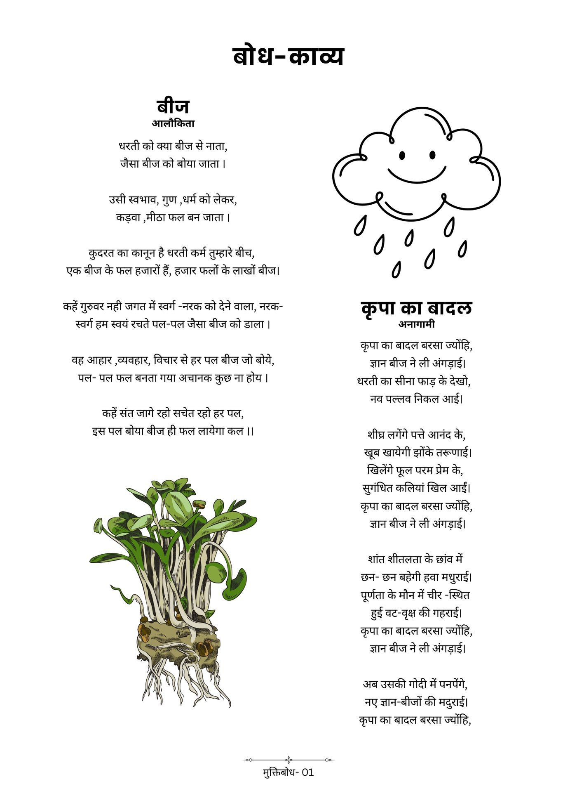

### OCR / Manuscript Text - Page 19

बोध-काव्य
बीज

आलौकिता

धरती को क्या बीज से नाता,
जैसा बीज को बोया जाता |

उसी स्वभाव, गुण ,धर्म को लेकर,
कड़वा ,मीठा फल बन जाता |

कुदरत का कानून है धरती कर्म तुम्हारे बीच,
एक बीज के फल हजारों हैं, हजार फलों के लाखों बीज।

कहें गुरुवर नही जगत में स्वर्ग -नरक को देने वाला, नरक-
स्वर्ग हम स्वयं रचते पल-पल जैसा बीज को डाला |

वह आहार ,व्यवहार, विचार से हर पल बीज जो बोये,
पल- पल फल बनता गया अचानक कुछ ना होय |

कहें संत जागे रहो सचेत रहो हर पल,
इस पल बोया बीज ही फल लायेगा कल ||

कृपा का बादल

अनागामी

कृपा का बादल बरसा ज्योंहि,
ज्ञान बीज ने ली अंगड़ाई।

धरती का सीना फाड़ के देखो,
नव पल्लव निकल आई।

शीघ्र लगेंगे पत्ते आनंद के,
खूब खायेगी झोंके तरूणाई।

खिलेंगे फूल परम प्रेम के,
सुगंधित कलियां खिल आई।
कृपा का बादल बरसा ज्योंहि,

ज्ञान बीज ने ली अंगड़ाई।

शांत शीतलता के छांव में
छन- छन बहेगी हवा मधुराई।
पूर्णता के मौन में चीर -स्थित
हुई वट-वृक्ष की गहराई।
कृपा का बादल बरसा ज्योंहि,
ज्ञान बीज ने ली अंगड़ाई।

अब उसकी गोदी में पनपेंगे,
नए ज्ञान-बीजों की मदुराई।
कृपा का बादल बरसा ज्योंहि,

---

## Page 20

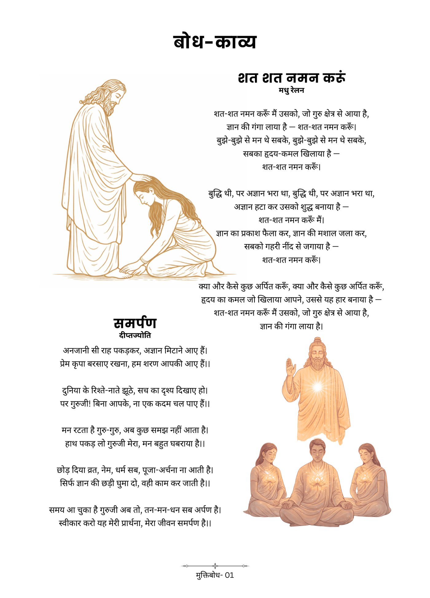

### OCR / Manuscript Text - Page 20

बोध-काव्य

शत शत नमन करुं

मधु रेलन

शत-शत नमन करूँ मैं उसको, जो गुर क्षेत्र से आया है,
ज्ञान की गंगा लाया है — शत-शत नमन HSI
बुझे-बुझे से मन थे सबके, बुझे-बुझे से मन थे सबके,
सबका हृदय-कमल खिलाया है —
शत-शत नमन HS]

बुद्धि थी, पर अज्ञान भरा था, बुद्धि थी, पर अज्ञान भरा था,
अज्ञान हटा कर उसको शुद्ध बनाया है —
शत-शत नमन करूँ मैं।
ज्ञान का प्रकाश फैला कर, ज्ञान की मशाल जला कर,
सबको गहरी नींद से जगाया है —
शत-शत नमन HS]

हृदय का कमल जो खिलाया आपने, उससे यह हार बनाया है —
शत-शत नमन करूँ मैं उसको, जो गुर क्षेत्र से आया है,

समर्पण ज्ञान की गंगा लाया है।
दीप्तज्योति

अनजानी सी राह पकड़कर, अज्ञान मिटाने आए हैं।
प्रेम कृपा बरसाए रखना, हम शरण आपकी आए हैं।।

दुनिया के रिश्ते-नाते झूठे, सच का दृश्य दिखाए हो।
पर गुरुजी! बिना आपके, ना एक कदम चल पाए Sl |

मन रटता है गुरु-गुरु, अब कुछ समझ नहीं आता Vl
हाथ पकड़ लो गुरुजी मेरा, मन बहुत घबराया है।।

छोड़ दिया व्रत, नेम, धर्म सब, पूजा-अर्चना ना आती है।
सिर्फ ज्ञान की छड़ी घुमा दो, वही काम कर जाती है।।

समय आ चुका है गुरुजी अब तो, तन-मन-धन सब अर्पण है।
स्वीकार करो यह मेरी प्रार्थना, मेरा जीवन समर्पण है।।

---

## Page 21

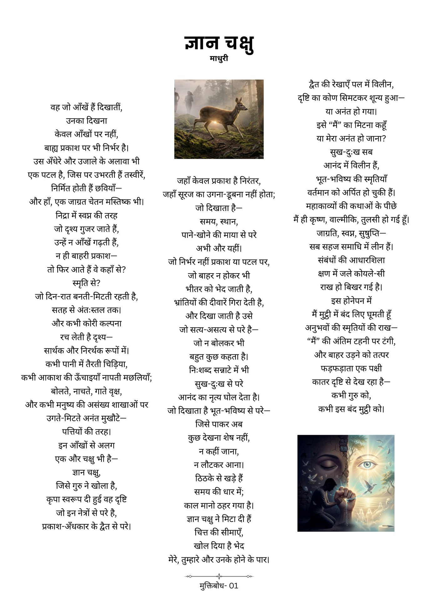

### OCR / Manuscript Text - Page 21

वह जो आँखें हैं दिखातीं,
उनका दिखना
केवल आँखों पर नहीं,
बाह्य प्रकाश पर भी निर्भर है।

उस अंधेरे और उजाले के अलावा भी
एक पटल है, जिस पर उभरती हैं तस्वीरें,

निर्मित होती हैं छवियाँ-

और हाँ, एक जाग्रत चेतन मस्तिष्क भी।

निद्रा में स्वप्न की तरह
जो दृश्य गुजर जाते हैं,
उन्हें न आँखें गढ़ती हैं,
न ही बाहरी प्रकाश-
तो फिर आते हैं वे कहाँ से?
स्मृति से?

जो दिन-रात बनती-मिटती रहती है,

सतह से अंतःस्तल THI
और कभी कोरी कल्पना
रच लेती है दृश्य-
सार्थक और निरर्थक रूपों में।
कभी पानी में तैरती चिड़िया,

कभी आकाश की ऊँचाइयाँ नापती मछलियाँ;

बोलते, नाचते, गाते वृक्ष,

और कभी मनुष्य की असंख्य शाखाओं पर

उगते-मिटते अनंत मुखौटे-
पत्तियों की तरह।
इन आँखों से अलग
एक और चक्षु भी है-
ज्ञान चक्षु,

जिसे गुरु ने खोला है,
कृपा स्वरूप दी हुई वह दृष्टि

जो इन नेत्रों से परे है,

प्रकाश-अँधकार के द्वैत से परे।

ज्ञान चक्षु

माधुरी

जहाँ केवल प्रकाश है निरंतर,
जहाँ सूरज का उगना-डूबना नहीं होता;
जो दिखाता है-
समय, स्थान,
पाने-खोने की माया से परे
अभी और यहीं।
जो निर्भर नहीं प्रकाश या पटल पर,
जो बाहर न होकर भी
भीतर को भेद जाती है,
श्रांतियों की दीवारें गिरा देती है,
और दिखा जाती है उसे
जो सत्य-असत्य से परे है-
जो न बोलकर भी
बहुत कुछ कहता है।
निःशब्द सन्नाटे में भी
सुख-दुःख से परे
आनंद का नृत्य घोल देता है।
जो दिखाता है भूत-भविष्य से परे-
जिसे पाकर अब
कुछ देखना शेष नहीं,
न कहीं जाना,
न लौटकर आना।
ठिठके से खड़े हैं
समय की धार में;
काल मानो ठहर गया है।
ज्ञान चक्षु ने मिटा दी हैं
चित्त की सीमाएँ,
खोल दिया है भेद
मेरे, तुम्हारे और उनके होने के पार।

2.

मुक्तिबोध- 01

द्वैत की रेखाएँ पल में विलीन,
दृष्टि का कोण सिमटकर शून्य हुआ-
या अनंत हो गया।
इसे “मैं” का मिटना कहूँ
या मेरा अनंत हो जाना?
सुख-दुःख सब
आनंद में विलीन हैं,
भूत-भविष्य की स्मृतियाँ
वर्तमान को अर्पित हो चुकी हैं।
महाकाव्यों की कथाओं के पीछे
मैं ही कृष्ण, वाल्मीकि, तुलसी हो गई हूँ
जाग्रति, स्वप्न, सुषुप्ति
सब सहज समाधि में लीन हैं।
संबंधों की आधारशिला
क्षण में जले कोयले-सी
राख हो बिखर गई है।
इस होनेपन में
मैं मुठी में बंद लिए घूमती हूँ
अनुभवों की स्मृतियों की राख-
मैं” की अंतिम टहनी पर टंगी,
और बाहर उड़ने को तत्पर
फड़फड़ाता एक पक्षी
कातर दृष्टि से देख रहा है-
कभी गुरु को,
कभी इस बंद ast को।

---

## Page 22

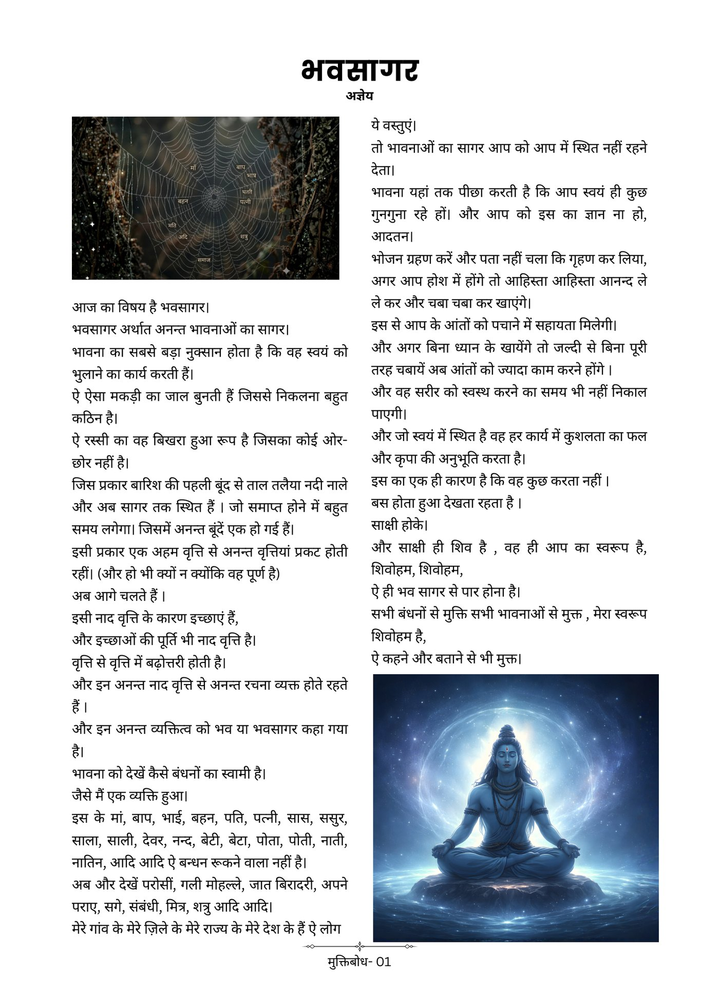

### OCR / Manuscript Text - Page 22

भवसागर

अज्ञेय

आज का विषय है भवसागर।

भवसागर अर्थात अनन्त भावनाओं का सागर।

भावना का सबसे बड़ा नुक्सान होता है कि वह स्वयं को
भुलाने का कार्य करती हैं।

ऐ ऐसा मकड़ी का जाल बुनती हैं जिससे निकलना बहुत
कठिन él

U रस्सी का वह बिखरा हुआ रूप है जिसका कोई ओर-
छोर नहीं है।

जिस प्रकार बारिश की पहली बूंद से ताल तलैया नदी नाले
और अब सागर तक स्थित हैं | जो समाप्त होने में बहुत
समय लगेगा। जिसमें अनन्त बूंदें एक हो गई हैं।

इसी प्रकार एक अहम वृत्ति से अनन्त वृत्तियां प्रकट होती
रहीं। (और हो भी क्यों न क्योंकि वह पूर्ण है)

अब आगे चलते हैं |

इसी नाद वृत्ति के कारण इच्छाएं हैं,

और इच्छाओं की पूर्ति भी नाद वृत्ति है।

वृत्ति से वृत्ति में बढ़ोत्तरी होती है।

और इन अनन्त नाद वृत्ति से अनन्त रचना व्यक्त होते रहते
él

और इन अनन्त व्यक्तित्व को भव या भवसागर कहा गया
है।

भावना को देखें कैसे बंधनों का स्वामी है।

जैसे मैं एक व्यक्ति हुआ।

इस के मां, बाप, भाई, बहन, पति, पत्नी, सास, ससुर,
साला, साली, देवर, नन्द, बेटी, बेटा, पोता, पोती, नाती,
नातिन, आदि आदि ऐ बन्धन रूकने वाला नहीं है।

अब और देखें परोसीं, गली मोहल्ले, जात बिरादरी, अपने
पराए, सगे, संबंधी, मित्र, शत्रु आदि आदि।

मेरे गांव के मेरे ज़िले के मेरे राज्य के मेरे देश के हैं ऐ लोग

ये वस्तुएं।

तो भावनाओं का सागर आप को आप में स्थित नहीं रहने
देता।

भावना यहां तक पीछा करती है कि आप स्वयं ही कुछ
गुनगुना रहे हों। और आप को इस काज्ञान ना हो,
आदतन।

भोजन ग्रहण करें और पता नहीं चला कि गृहण कर लिया,
अगर आप होश में होंगे तो आहिस्ता आहिस्ता आनन्द ले
ले कर और चबा चबा कर खाएंगे।

इस से आप के आंतों को पचाने में सहायता मिलेगी।

और अगर बिना ध्यान के खायेंगे तो जल्दी से बिना पूरी
तरह चबायें अब आंतों को ज्यादा काम करने होंगे |

और वह सरीर को स्वस्थ करने का समय भी नहीं निकाल
पाएगी।

और जो स्वयं में स्थित है वह हर कार्य में कुशलता का फल
और कृपा की अनुभूति करता है।

इस का एक ही कारण है कि वह कुछ करता नहीं |

बस होता हुआ देखता रहता है |

साक्षी होके।

और साक्षी ही शिव है , वह ही आप का स्वरूप है,
शिवोहम, शिवोहम,

td भव सागर से पार होना है।

सभी बंधनों से मुक्ति सभी भावनाओं से मुक्त , मेरा स्वरूप
शिवोहम है,

U कहने और बताने से भी मुक्त।

---

## Page 23

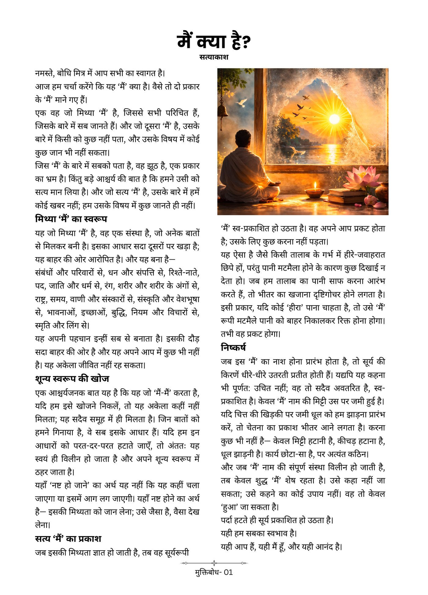

### OCR / Manuscript Text - Page 23

मैं क्या है?

सत्याकाश

नमस्ते, बोधि मित्र में आप सभी का स्वागत है।

आज हम चर्चा करेंगे कि यह “FP कया है। वैसे तो दो प्रकार
के FP माने गए हैं।

एक वह जो मिथ्या 'मैं' है, जिससे सभी परिचित हैं,
जिसके बारे में सब जानते हैं। और जो दूसरा “A है, उसके
बारे में किसी को कुछ नहीं पता, और उसके विषय में कोई
कुछ ज्ञान भी नहीं सकता।

जिस “मैं के बारे में सबको पता है, वह झूठ है, एक प्रकार
का भ्रम है। किंतु बड़े आश्चर्य की बात है कि हमने उसी को
सत्य मान लिया है। और जो सत्य “FY है, उसके बारे में हमें
कोई खबर नहीं; हम उसके विषय में कुछ जानते ही नहीं
मिथ्या “मैं? का स्वरूप

यह जो मिथ्या “मैं” है, वह एक संस्था है, जो अनेक बातों
से मिलकर बनी है। इसका आधार सदा दूसरों पर खड़ा है;
यह बाहर की ओर आरोपित है। और यह बना है-

संबंधों और परिवारों से, धन और संपत्ति से, रिश्ते-नाते,
पद, जाति और धर्म से, रंग, शरीर और शरीर के अंगों से,
राष्ट्र, समय, वाणी और संस्कारों से, संस्कृति और वेशभूषा
से, भावनाओं, इच्छाओं, बुद्धि, नियम और विचारों से,
स्मृति और लिंग से।

यह अपनी पहचान इन्हीं सब से बनाता है। इसकी दौड़
सदा बाहर की ओर है और यह अपने आप में कुछ भी नहीं
है। यह अकेला जीवित नहीं रह सकता।

शून्य स्वरूप की खोज

एक आश्चर्यजनक बात यह है कि यह जो 'मैं-मैं' करता है,
यदि हम इसे खोजने निकलें, तो यह अकेला कहीं नहीं
मिलता; यह सदैव समूह में ही मिलता है। जिन बातों को
हमने गिनाया है, वे सब इसके आधार हैं। यदि हम इन
आधारों को परत-दर-परत हटाते जाएँ, तो अंततः यह
स्वयं ही विलीन हो जाता है और अपने शून्य स्वरूप में
ठहर जाता है।

यहाँ नष्ट हो जाने' का अर्थ यह नहीं कि यह कहीं चला
जाएगा या इसमें आग लग जाएगी। यहाँ नष्ट होने का अर्थ
है- इसकी मिथ्यता को ज्ञान लेना; उसे जैसा है, वैसा देख
लेना।

सत्य ‘A का प्रकाश

जब इसकी मिथ्यता ज्ञात हो जाती है, तब वह सूर्यरूपी

मैं' स्व-प्रकाशित हो उठता है। वह अपने आप प्रकट होता
है; उसके लिए कुछ करना नहीं पड़ता।

यह ऐसा है जैसे किसी तालाब के गर्भ में हीरे-जवाहरात
छिपे हों, परंतु पानी मटमैला होने के कारण कुछ दिखाई न
देता हो। जब हम तालाब का पानी साफ करना आरंभ
करते हैं, तो भीतर का खजाना दृष्टिगोचर होने लगता है।
इसी प्रकार, यदि कोई “हीरा” पाना चाहता है, तो उसे “मैं
रूपी मटमैले पानी को बाहर निकालकर रिक्त होना होगा।
तभी वह प्रकट होगा।

निष्कर्ष

जब इस A का नाश होना प्रारंभ होता है, तो सूर्य की
किरणें धीरे-धीरे उतरती प्रतीत होती हैं। यद्यपि यह कहना
भी पूर्णत: उचित नहीं; वह तो सदैव अवतरित है, स्व-
प्रकाशित है। केवल “A नाम की मिट्टी उस पर जमी हुई है।
यदि चित्त की खिड़की पर जमी धूल को हम झाड़ना प्रारंभ
करें, तो चेतना का प्रकाश भीतर आने लगता है। करना
कुछ भी नहीं है- केवल मिट्टी हटानी है, कीचड़ हटाना है,
धूल झाड़नी है। कार्य छोटा-सा है, पर अत्यंत कठिन।

और जब 'मैं' नाम की संपूर्ण संस्था विलीन हो जाती है,
तब केवल शुद्ध A शेष रहता Vl उसे कहा नहीं जा
सकता; उसे कहने का कोई उपाय नहीं। वह तो केवल
“हुआ” जा सकता है।

पर्दा हटते ही सूर्य प्रकाशित हो उठता है।

यही हम सबका स्वभाव है।

यही आप हैं, यही मैं हूँ, और यही आनंद है।

मुक्तिबोध- 01

---

## Page 24

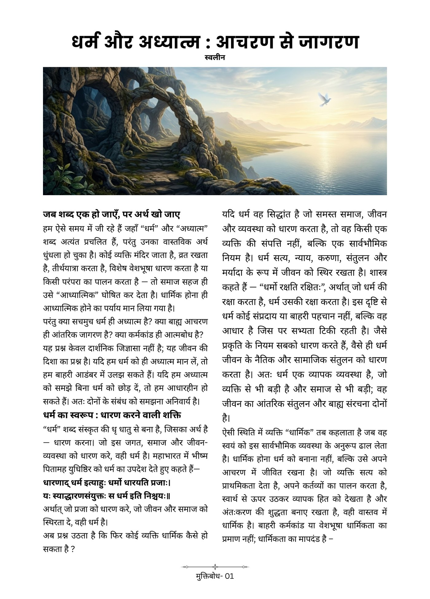

### OCR / Manuscript Text - Page 24

धर्म और अध्यात्म :

आचरण से जागरण

स्वलीन

जब शब्द एक हो जाएँ, पर अर्थ खो जाए

हम ऐसे समय में जी रहे हैं जहाँ “धर्म” और “अध्यात्म”
शब्द अत्यंत प्रचलित हैं, परंतु उनका वास्तविक अर्थ
धुंधला हो चुका है। कोई व्यक्ति मंदिर जाता है, व्रत रखता
है, तीर्थयात्रा करता है, विशेष वेशभूषा धारण करता है या
किसी परंपरा का पालन करता है — तो समाज सहज ही
उसे “आध्यात्मिक” घोषित कर देता है। धार्मिक होना ही
आध्यात्मिक होने का पर्याय मान लिया गया है।

परंतु क्या सचमुच धर्म ही अध्यात्म है? क्या बाह्य आचरण
ही आंतरिक जागरण है? क्या कर्मकांड ही आत्मबोध है?
यह प्रश्न केवल दार्शनिक जिज्ञासा नहीं है; यह जीवन की
दिशा का प्रश्न है। यदि हम धर्म को ही अध्यात्म मान लें, तो
हम बाहरी आडंबर में उलझ सकते हैं। यदि हम अध्यात्म
को समझे बिना धर्म को छोड़ दें, तो हम आधारहीन हो
सकते हैं। अतः दोनों के संबंध को समझना अनिवार्य है।
धर्म का स्वरूप : धारण करने वाली शक्ति

“धर्म” शब्द संस्कृत की धृ धातु से बना है, जिसका अर्थ है
— धारण करना। जो इस जगत, समाज और जीवन-
व्यवस्था को धारण करे, वही धर्म है। महाभारत में भीष्म
पितामह युधिष्ठिर को धर्म का उपदेश देते हुए कहते हैं-
धारणाद्‌ धर्म इत्याहुः धर्मो धारयति प्रजाः।

यः स्याद्धारणसंयुक्तः स धर्म इति निश्चयः॥

अर्थात्‌ जो प्रजा को धारण करे, जो जीवन और समाज को
स्थिरता दे, वही धर्म है।

अब प्रश्न उठता है कि फिर कोई व्यक्ति धार्मिक कैसे हो
सकता है?

यदि धर्म वह सिद्धांत है जो समस्त समाज, जीवन
और व्यवस्था को धारण करता है, तो वह किसी एक
व्यक्ति की संपत्ति नहीं, बल्कि एक सार्वभौमिक
नियम है। धर्म सत्य, न्याय, करुणा, संतुलन और
मर्यादा के रूप में जीवन को स्थिर रखता है। शास्त्र
कहते हैं — “धर्मो रक्षति रक्षितः”, अर्थात्‌ जो धर्म की
रक्षा करता है, धर्म उसकी रक्षा करता है। इस दृष्टि से
धर्म कोई संप्रदाय या बाहरी पहचान नहीं, बल्कि वह
आधार है जिस पर सभ्यता टिकी रहती है। जैसे
प्रकृति के नियम सबको धारण करते हैं, वैसे ही धर्म
जीवन के नैतिक और सामाजिक संतुलन को धारण
करता है। अतः धर्म एक व्यापक व्यवस्था है, जो
व्यक्ति से भी बड़ी है और समाज से भी बड़ी; वह
जीवन का आंतरिक संतुलन और बाह्य संरचना दोनों
है।

ऐसी स्थिति में व्यक्ति “धार्मिक” तब कहलाता है जब वह
स्वयं को इस सार्वभौमिक व्यवस्था के अनुरूप ढाल लेता
है। धार्मिक होना धर्म को बनाना नहीं, बल्कि उसे अपने
आचरण में जीवित रखना है। जो व्यक्ति सत्य को
प्राथमिकता देता है, अपने कर्तव्यों का पालन करता है,
स्वार्थ से ऊपर उठकर व्यापक हित को देखता है और
अंतःकरण की शुद्धता बनाए रखता है, वही वास्तव में
धार्मिक है। बाहरी कर्मकांड या वेशभूषा धार्मिकता का
प्रमाण नहीं; धार्मिकता का मापदंड है -

2.
oo

मुक्तिबोध- 01

---

## Page 25

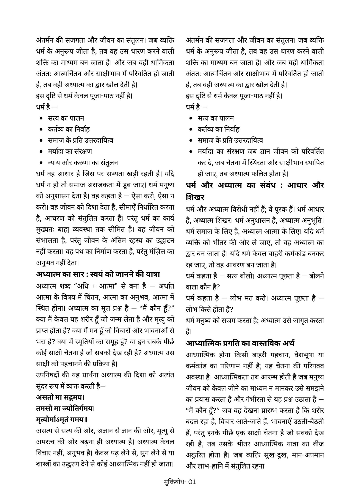

### OCR / Manuscript Text - Page 25

अंतर्मन की सजगता और जीवन का संतुलन। जब व्यक्ति
धर्म के अनुरूप जीता है, तब वह उस धारण करने वाली
शक्ति का माध्यम बन जाता है। और जब यही धार्मिकता
अंततः आत्मचिंतन और साक्षीभाव में परिवर्तित हो जाती
है, तब वही अध्यात्म का द्वार खोल देती है।
इस दृष्टि से धर्म केवल पूजा-पाठ नहीं है।
धर्म है —

° सत्य का पालन

° कर्तव्य का निर्वाह

१ समाज के प्रति उत्तरदायित्व

® मर्यादा का संरक्षण

e न्याय और करुणा का संतुलन
धर्म वह आधार है जिस पर सभ्यता खड़ी रहती है। यदि
धर्म न हो तो समाज अराजकता में डूब जाए। धर्म मनुष्य
को अनुशासन देता है। वह कहता है - ऐसा करो, ऐसा न
करो। वह जीवन को दिशा देता है, सीमाएँ निर्धारित करता
है, आचरण को संतुलित करता है। परंतु धर्म का कार्य
मुख्यतः बाह्य व्यवस्था तक सीमित है। वह जीवन को
संभालता है, परंतु जीवन के अंतिम रहस्य का उद्घाटन
नहीं करता। वह पथ का निर्माण करता है, परंतु मंज़िल का
अनुभव नहीं देता।
अध्यात्म का सार : स्वयं को जानने की यात्रा
अध्यात्म शब्द “अधि + आत्मा” से बना है - अर्थात
आत्मा के विषय में चिंतन, आत्मा का अनुभव, आत्मा में
स्थित होना। अध्यात्म का मूल प्रश्न है — “मैं कौन हूँ?”
क्या मैं केवल यह शरीर हूँ जो जन्म लेता है और मृत्यु को
प्राप्त होता है? क्या मैं मन हूँ जो विचारों और भावनाओं से
भरा है? क्या मैं स्मृतियों का समूह हूँ? या इन सबके पीछे
कोई साक्षी चेतना है जो सबको देख रही है? अध्यात्म उस
साक्षी को पहचानने की प्रक्रिया है।
उपनिषदों की यह प्रार्थना अध्यात्म की दिशा को अत्यंत
सुंदर रूप में व्यक्त करती है-
असतो मा सद्गमय
तमसो मा ज्योतिर्गमय।
मृत्योर्माऽमृतं गमय॥
असत्य से सत्य की ओर, अज्ञान से ज्ञान की ओर, मृत्यु से
अमरत्व की ओर बढ़ना ही अध्यात्म है। अध्यात्म केवल
विचार नहीं, अनुभव है। केवल पढ़ लेने से, सुन लेने से या
शास्त्रों का उद्धरण देने से कोई आध्यात्मिक नहीं हो जाता।

अंतर्मन की सजगता और जीवन का संतुलन। जब व्यक्ति
धर्म के अनुरूप जीता है, तब वह उस धारण करने वाली
शक्ति का माध्यम बन जाता है। और जब यही धार्मिकता
अंततः आत्मचिंतन और साक्षीभाव में परिवर्तित हो जाती
है, तब वही अध्यात्म का द्वार खोल देती है।
इस दृष्टि से धर्म केवल पूजा-पाठ नहीं है।
धर्म है —

° सत्य का पालन

® कर्तव्य का निर्वाह

e समाज के प्रति उत्तरदायित्व

e मर्यादा का संरक्षण जब ज्ञान जीवन को परिवर्तित

कर दे, जब चेतना में स्थिरता और साक्षीभाव स्थापित
हो जाए, तब अध्यात्म फलित होता है।

धर्म और अध्यात्म का संबंध : आधार और
शिखर
धर्म और अध्यात्म विरोधी नहीं हैं; वे पूरक हैं। धर्म आधार
है, अध्यात्म शिखर। धर्म अनुशासन है, अध्यात्म अनुभूति।
धर्म समाज के लिए है, अध्यात्म आत्मा के लिए। यदि धर्म
व्यक्ति को भीतर की ओर ले जाए, तो वह अध्यात्म का
द्वार बन जाता है। यदि धर्म केवल बाहरी कर्मकांड बनकर
रह जाए, तो वह आवरण बन जाता है।
धर्म कहता है — सत्य बोलो। अध्यात्म पूछता है — बोलने
वाला कौन है?
धर्म कहता है — लोभ मत Hell अध्यात्म पूछता है -
लोभ किसे होता है?
धर्म मनुष्य को सजग करता है; अध्यात्म उसे जागृत करता
है।
आध्यात्मिक प्रगति का वास्तविक अर्थ
आध्यात्मिक होना किसी बाहरी पहचान, वेशभूषा या
कर्मकांड का परिणाम नहीं है; यह चेतना की परिपक्व
अवस्था है। आध्यात्मिकता तब आरम्भ होती है जब मनुष्य
जीवन को केवल जीने का माध्यम न मानकर उसे समझने
का प्रयास करता है और गंभीरता से यह प्रश्न उठाता है —
“मैं कौन हूँ?” जब वह देखना प्रारम्भ करता है कि शरीर
बदल रहा है, विचार आते-जाते हैं, भावनाएँ उठती-बैठती
हैं, परंतु इनके पीछे एक साक्षी चेतना है जो सबको देख
रही है, तब उसके भीतर आध्यात्मिक यात्रा का बीज
अंकुरित होता है। जब व्यक्ति सुख-दुख, मान-अपमान
और लाभ-हानि में संतुलित रहना

मुक्तिबोध- 01

---

## Page 26

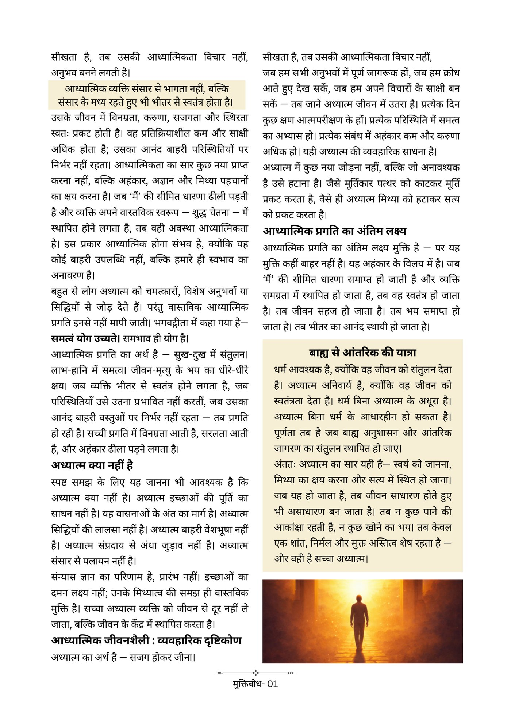

### OCR / Manuscript Text - Page 26

सीखता है, तब उसकी आध्यात्मिकता विचार नहीं,
अनुभव बनने लगती है।
आध्यात्मिक व्यक्ति संसार से भागता नहीं, बल्कि

संसार के मध्य रहते हुए भी भीतर से स्वतंत्र होता है।
उसके जीवन में विनम्रता, करुणा, सजगता और स्थिरता
स्वतः प्रकट होती है। वह प्रतिक्रियाशील कम और साक्षी
अधिक होता है; उसका आनंद बाहरी परिस्थितियों पर
निर्भर नहीं रहता। आध्यात्मिकता का सार कुछ नया प्राप्त
करना नहीं, बल्कि अहंकार, अज्ञान और मिथ्या पहचानों
का क्षय करना है। जब “A की सीमित धारणा ढीली पड़ती
है और व्यक्ति अपने वास्तविक स्वरूप - शुद्ध चेतना - में
स्थापित होने लगता है, तब वही अवस्था आध्यात्मिकता
है। इस प्रकार आध्यात्मिक होना संभव है, क्योंकि यह
कोई बाहरी उपलब्धि नहीं, बल्कि हमारे ही स्वभाव का
अनावरण है।
बहुत से लोग अध्यात्म को चमत्कारों, विशेष अनुभवों या
सिद्धियों से जोड़ देते हैं। परंतु वास्तविक आध्यात्मिक
प्रगति इनसे नहीं मापी जाती। भगवद्गीता में कहा गया है-
समत्वं योग उच्यते। समभाव ही योग है।
आध्यात्मिक प्रगति का अर्थ है — सुख-दुख में संतुलन।
लाभ-हानि में समत्व। जीवन-मृत्यु के भय का धीरे-धीरे
क्षय। जब व्यक्ति भीतर से स्वतंत्र होने लगता है, जब
परिस्थितियाँ उसे उतना प्रभावित नहीं करतीं, जब उसका
आनंद बाहरी वस्तुओं पर निर्भर नहीं रहता - तब प्रगति
हो रही है। सच्ची प्रगति में विनम्रता आती है, सरलता आती
है, और अहंकार ढीला पड़ने लगता है।
अध्यात्म क्या नहीं है
स्पष्ट समझ के लिए यह जानना भी आवश्यक है कि
अध्यात्म क्या नहीं है। अध्यात्म इच्छाओं की पूर्ति का
साधन नहीं है। यह वासनाओं के अंत का मार्ग है। अध्यात्म
सिद्धियों की लालसा नहीं है। अध्यात्म बाहरी वेशभूषा नहीं
है। अध्यात्म संप्रदाय से अंधा जुड़ाव नहीं है। अध्यात्म
संसार से पलायन नहीं है।
संन्यास ज्ञान का परिणाम है, प्रारंभ नहीं। इच्छाओं का
दमन लक्ष्य नहीं; उनके मिथ्यात्व की समझ ही वास्तविक
मुक्ति है। सच्चा अध्यात्म व्यक्ति को जीवन से दूर नहीं ले
जाता, बल्कि जीवन के केंद्र में स्थापित करता है।
आध्यात्मिक जीवनशैली : व्यवहारिक दृष्टिकोण
अध्यात्म का अर्थ है — सजग होकर जीना।

सीखता है, तब उसकी आध्यात्मिकता विचार नहीं,

जब हम सभी अनुभवों में पूर्ण जागरूक हों, जब हम क्रोध
आते हुए देख सकें, जब हम अपने विचारों के साक्षी बन
सकें - तब जाने अध्यात्म जीवन में उतरा है। प्रत्येक दिन
कुछ क्षण आत्मपरीक्षण के हों। प्रत्येक परिस्थिति में समत्व
का अभ्यास हो। प्रत्येक संबंध में अहंकार कम और करुणा
अधिक हो। यही अध्यात्म की व्यवहारिक साधना है।
अध्यात्म में कुछ नया जोड़ना नहीं, बल्कि जो अनावश्यक
है उसे हटाना है। जैसे मूर्तिकार पत्थर को काटकर मूर्ति
प्रकट करता है, वैसे ही अध्यात्म मिथ्या को हटाकर सत्य
को प्रकट करता है।

आध्यात्मिक प्रगति का अंतिम लक्ष्य

आध्यात्मिक प्रगति का अंतिम लक्ष्य मुक्ति है — पर यह
मुक्ति कहीं बाहर नहीं है। यह अहंकार के विलय में है। जब
a की सीमित धारणा समाप्त हो जाती है और व्यक्ति
समग्रता में स्थापित हो जाता है, तब वह स्वतंत्र हो जाता
है। तब जीवन सहज हो जाता है। तब भय समाप्त हो
जाता है। तब भीतर का आनंद स्थायी हो जाता है।

बाह्य से आंतरिक की यात्रा

धर्म आवश्यक है, क्योंकि वह जीवन को संतुलन देता
है। अध्यात्म अनिवार्य है, क्योंकि वह जीवन को
स्वतंत्रता देता है। धर्म बिना अध्यात्म के अधूरा है।
अध्यात्म बिना धर्म के आधारहीन हो सकता है।
पूर्णता तब है जब बाह्य अनुशासन और आंतरिक
जागरण का संतुलन स्थापित हो जाए।

अंततः अध्यात्म का सार यही है- स्वयं को जानना,
मिथ्या का क्षय करना और सत्य में स्थित हो जाना।
जब यह हो जाता है, तब जीवन साधारण होते हुए
भी असाधारण बन जाता है। तब न कुछ पाने की
आकांक्षा रहती है, न कुछ खोने का भय। तब केवल
एक शांत, निर्मल और मुक्त अस्तित्व शेष रहता है —
और वही है सच्चा अध्यात्म।

2.
oo

मुक्तिबोध- 01

---

## Page 27

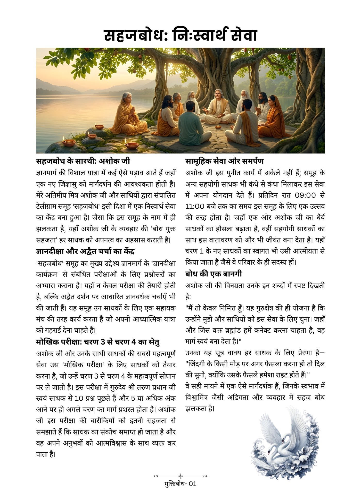

### OCR / Manuscript Text - Page 27

सहजबोध के सारथी: अशोक जी

ज्ञानमार्ग की विशाल यात्रा में कई ऐसे पड़ाव आते हैं जहाँ
एक नए जिज्ञासु को मार्गदर्शन की आवश्यकता होती है।
मेरे अतिमीय मित्र अशोक जी और साथियों द्वारा संचालित
टेलीग्राम समूह 'सहजबोध' इसी दिशा में एक निस्वार्थ सेवा
का केंद्र बना हुआ है। जैसा कि इस समूह के नाम में ही
झलकता है, यहाँ अशोक जी के व्यवहार की 'बोध युक्त
सहजता' हर साधक को अपनत्व का अहसास कराती है।
ज्ञानदीक्षा और अद्वैत चर्चा का केंद्र

'सहजबोध' समूह का मुख्य उद्देश्य ज्ञानमार्ग के 'ज्ञानदीक्षा
कार्यक्रम' से संबंधित परीक्षाओं के लिए प्रश्नोत्तरों का
अभ्यास कराना है। यहाँ न केवल परीक्षा की तैयारी होती
है, बल्कि अद्वैत दर्शन पर आधारित ज्ञानवर्धक चर्चाएँ भी
की जाती हैं। यह समूह उन साधकों के लिए एक सहायक
मंच की तरह कार्य करता है जो अपनी आध्यात्मिक यात्रा
को गहराई देना चाहते हैं।

मौखिक परीक्षा: चरण ३ से चरण 4 का सेतु
अशोक जी और उनके साथी साधकों की सबसे महत्वपूर्ण
सेवा उस 'मौखिक परीक्षा' के लिए साधकों को तैयार
करना है, जो उन्हें चरण 3 से चरण 4 के महत्वपूर्ण सोपान
पर ले जाती है। इस परीक्षा में गुरुदेव श्री तरुण प्रधान जी
स्वयं साधक से 10 प्रश्न पूछते हैं और 5 या अधिक अंक
आने पर ही अगले चरण का मार्ग प्रशस्त होता है। अशोक
जी इस परीक्षा की बारीकियों को इतनी सहजता से
समझाते हैं कि साधक का संकोच समाप्त हो जाता है और
वह अपने अनुभवों को आत्मविश्वास के साथ व्यक्त कर
पाता है।

मुक्तिबोध- 01

सामूहिक सेवा और समर्पण

अशोक जी इस पुनीत कार्य में अकेले नहीं हैं; समूह के
अन्य सहयोगी साधक भी कंधे से कंधा मिलाकर इस सेवा
में अपना योगदान देते हैं। प्रतिदिन रात 09:00 से
11:00 बजे तक का समय इस समूह के लिए एक उत्सव
की तरह होता है। जहाँ एक ओर अशोक जी का धैर्य
साधकों का हौसला बढ़ाता है, वहीं सहयोगी साधकों का
साथ इस वातावरण को और भी जीवंत बना देता है। यहाँ
चरण 1 के नए साधकों का स्वागत भी उसी आत्मीयता से
किया जाता है जैसे वे परिवार के ही सदस्य हों।

बोध की एक बानगी

अशोक जी की विनम्रता उनके इन शब्दों में स्पष्ट दिखती
हैः

मैं तो केवल निमित्त gi यह Teas की ही योजना है कि
उन्होंने मुझे और साथियों को इस सेवा के लिए चुना। जहाँ
और जिस वक्त ब्रह्मांड हमें कनेक्ट करना चाहता है, वह
मार्ग स्वयं बना देता है।'"

उनका यह सूत्र वाक्य हर साधक के लिए प्रेरणा है-
"जिंदगी के किसी मोड़ पर अगर फैसला करना हो तो दिल
की सुनो, क्योंकि उसके फैसले हमेशा राइट होते SI"

वे सही मायने में एक ऐसे मार्गदर्शक हैं, जिनके स्वभाव में
विश्वामित्र जैसी अडिगता और व्यवहार में सहज बोध
झलकता है।

2.
oe

---

## Page 28

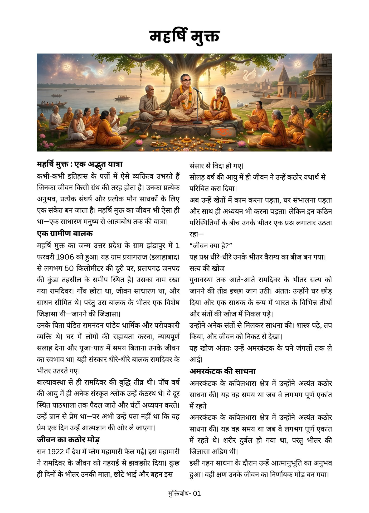

### OCR / Manuscript Text - Page 28

महर्षि मुक्त : एक अद्भुत यात्रा

कभी-कभी इतिहास के पन्नों में ऐसे व्यक्तित्व उभरते हैं
जिनका जीवन किसी ग्रंथ की तरह होता है। उनका प्रत्येक
अनुभव, प्रत्येक संघर्ष और प्रत्येक मौन साधकों के लिए
एक संकेत बन जाता है। महर्षि मुक्त का जीवन भी ऐसा ही
था-एक साधारण मनुष्य से आत्मबोध तक की यात्रा।
एक ग्रामीण बालक

महर्षि मुक्त का जन्म उत्तर प्रदेश के ग्राम झंडापुर में 1
फरवरी 1906 को हुआ। यह ग्राम प्रयागराज (इलाहाबाद)
से लगभग 50 किलोमीटर की दूरी पर, प्रतापगढ़ जनपद
की कुंडा तहसील के समीप स्थित है। उसका नाम रखा
गया रामदिवर। गाँव छोटा था, जीवन साधारण था, और
साधन सीमित थे। परंतु उस बालक के भीतर एक विशेष
जिज्ञासा थी-जानने की जिज्ञासा।

उनके पिता पंडित रामनंदन पांडेय धार्मिक और परोपकारी
व्यक्ति थे। घर में लोगों की सहायता करना, न्यायपूर्ण
सलाह देना और पूजा-पाठ में समय बिताना उनके जीवन
का स्वभाव था। यही संस्कार धीरे-धीरे बालक रामदिवर के
भीतर उतरते गए।

बाल्यावस्था से ही रामदिवर की बुद्धि तीव्र थी। पाँच वर्ष
की आयु में ही अनेक संस्कृत श्लोक उन्हें कंठस्थ थे। वे दूर
स्थित पाठशाला तक पैदल जाते और घंटों अध्ययन करते।
उन्हें ज्ञान से प्रेम था-पर अभी उन्हें पता नहीं था कि यह
प्रेम एक दिन उन्हें आत्मज्ञान की ओर ले जाएगा।

जीवन का कठोर मोड़

सन 1922 में देश में प्लेग महामारी फैल गई। इस महामारी
ने रामदिवर के जीवन को गहराई से झकझोर दिया। कुछ
ही दिनों के भीतर उनकी माता, छोटे भाई और बहन इस

संसार से विदा हो गए।

सोलह वर्ष की आयु में ही जीवन ने उन्हें कठोर यथार्थ से
परिचित करा दिया।

अब उन्हें खेतों में काम करना पड़ता, घर संभालना पड़ता
और साथ ही अध्ययन भी करना पड़ता। लेकिन इन कठिन
परिस्थितियों के बीच उनके भीतर एक प्रश्न लगातार उठता
रहा-

“जीवन कया है?”

यह प्रश्न धीरे-धीरे उनके भीतर वैराग्य का बीज बन गया।
सत्य की खोज

युवावस्था तक आते-आते रामदिवर के भीतर सत्य को
जानने की तीव्र इच्छा जाग उठी। अंततः उन्होंने घर छोड़
दिया और एक साधक के रूप में भारत के विभिन्न तीर्थो
और संतों की खोज में निकल पड़े।

उन्होंने अनेक संतों से मिलकर साधना की। शास्त्र पढ़े, तप
किया, और जीवन को निकट से देखा।

यह खोज अंततः उन्हें अमरकंटक के घने जंगलों तक ले
आई।

अमरकंटक की साधना

अमरकंटक के कपिलधारा क्षेत्र में उन्होंने अत्यंत कठोर
साधना की। यह वह समय था जब वे लगभग पूर्ण एकांत
में रहते

अमरकंटक के कपिलधारा क्षेत्र में उन्होंने अत्यंत कठोर
साधना की। यह वह समय था जब वे लगभग पूर्ण एकांत
में रहते थे। शरीर दुर्बल हो गया था, परंतु भीतर की
जिज्ञासा अडिग थी।

इसी गहन साधना के दौरान उन्हें आत्मानुभूति का अनुभव
हुआ। वही क्षण उनके जीवन का निर्णायक मोड़ बन गया।

मुक्तिबोध- 01

---

## Page 29

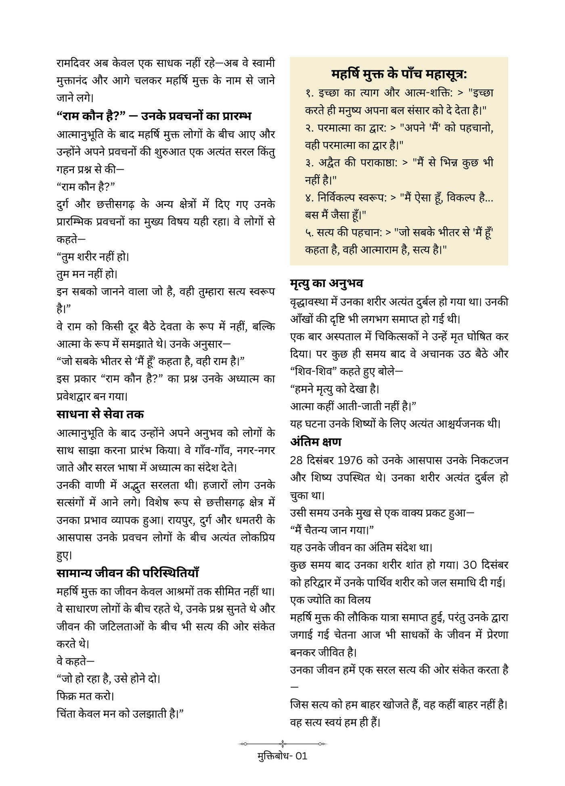

### OCR / Manuscript Text - Page 29

रामदिवर अब केवल एक साधक नहीं रहे-अब वे स्वामी
मुक्तानंद और आगे चलकर महर्षि मुक्त के नाम से जाने
जाने लगे।

“राम कौन है?” - उनके प्रवचनों का प्रारम्भ
आत्मानुभूति के बाद महर्षि मुक्त लोगों के बीच आए और
उन्होंने अपने प्रवचनों की शुरुआत एक अत्यंत सरल किंतु
गहन प्रश्न से की-

“राम कौन है?”

दुर्ग और छत्तीसगढ़ के अन्य क्षेत्रों में दिए गए उनके
प्रारम्भिक प्रवचनों का मुख्य विषय यही रहा। वे लोगों से
कहते-

“तुम शरीर नहीं हो।

तुम मन नहीं हो।

इन सबको जानने वाला जो है, वही तुम्हारा सत्य स्वरूप
है।”

वे राम को किसी दूर बैठे देवता के रूप में नहीं, बल्कि
आत्मा के रूप में समझाते थे। उनके अनुसार-

“जो सबके भीतर से “मैं हूँ! कहता है, वही राम है।”

इस प्रकार “राम कौन है?” का प्रश्न उनके अध्यात्म का
प्रवेशद्वार बन गया।

साधना से सेवा तक

आत्मानुभूति के बाद उन्होंने अपने अनुभव को लोगों के
साथ साझा करना प्रारंभ किया। वे गाँव-गाँव, नगर-नगर
जाते और सरल भाषा में अध्यात्म का संदेश देते।

उनकी वाणी में अद्भुत सरलता थी। हजारों लोग उनके
सत्संगों में आने लगे। विशेष रूप से छत्तीसगढ़ क्षेत्र में
उनका प्रभाव व्यापक हुआ। रायपुर, दुर्ग और धमतरी के
आसपास उनके प्रवचन लोगों के बीच अत्यंत लोकप्रिय
हुए।

सामान्य जीवन की परिस्थितियाँ

महर्षि मुक्त का जीवन केवल आश्रमं तक सीमित नहीं था।
वे साधारण लोगों के बीच रहते थे, उनके प्रश्न सुनते थे और
जीवन की जटिलताओं के बीच भी सत्य की ओर संकेत
करते थे।

वे कहते-

“जो हो रहा है, उसे होने दो।

फिक्र मत करो।

चिंता केवल मन को उलझाती है।”

2.

महर्षि मुक्त के पाँच महासूत्र:
१. इच्छा का त्याग और आत्म-शक्ति: &gt; "इच्छा
करते ही मनुष्य अपना बल संसार को दे देता है।"
२. परमात्मा का द्वार: &gt; "अपने 'मैं' को पहचानो,
वही परमात्मा का द्वार el"
३. अद्वैत की पराकाष्ठा: &gt; "मैं से भिन्न कुछ भी
नहीं है।"
४. निर्विकल्प स्वरूपः &gt; "मैं ऐसा हूँ, विकल्प है...
बस मैं जैसा gi"
५. सत्य की पहचान: &gt; "जो सबके भीतर से 'मैं हूँ
कहता है, वही आत्माराम है, सत्य Sl"

मृत्यु का अनुभव
वृद्धावस्था में उनका शरीर अत्यंत दुर्बल हो गया था। उनकी

आँखों की दृष्टि भी लगभग समाप्त हो गई थी।

एक बार अस्पताल में चिकित्सकों ने उन्हें मृत घोषित कर
दिया। पर कुछ ही समय बाद वे अचानक उठ बैठे और
“शिव-शिव” कहते हुए बोले-

“हमने मृत्यु को देखा है।

आत्मा कहीं आती-जाती नहीं है।”

यह घटना उनके शिष्यों के लिए अत्यंत आश्चर्यजनक थी।
अंतिम क्षण

28 दिसंबर 1976 को उनके आसपास उनके निकटजन
और शिष्य उपस्थित थे। उनका शरीर अत्यंत दुर्बल हो
चुका था।

उसी समय उनके मुख से एक वाक्य प्रकट हुआ-

“तैं चैतन्य ज्ञान गया।”

यह उनके जीवन का अंतिम संदेश था।

कुछ समय बाद उनका शरीर शांत हो गया। 30 दिसंबर
को हरिद्वार में उनके पार्थिव शरीर को जल समाधि दी गई।
एक ज्योति का विलय

महर्षि मुक्त की लौकिक यात्रा समाप्त हुई, परंतु उनके द्वारा
जगाई गई चेतना आज भी साधकों के जीवन में प्रेरणा
बनकर जीवित है।

उनका जीवन हमें एक सरल सत्य की ओर संकेत करता है
जिस सत्य को हम बाहर खोजते हैं, वह कहीं बाहर नहीं है।
वह सत्य स्वयं हम ही हैं।

मुक्तिबोध- 01

---

## Page 30

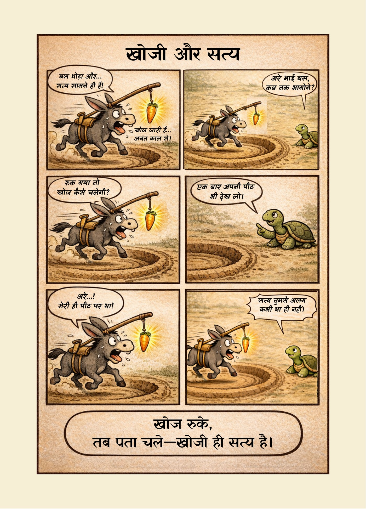

### OCR / Manuscript Text - Page 30

खोजी और सत्य

खोजी: बस थोड़ा और... सत्य सामने ही है!

कछुआ: अरे भाई बस, कब तक भागोगे?

खोजी: रुक गया तो खोज कैसे चलेगी?

कछुआ: एक बार अपनी पीठ भी देख लो।

खोजी: अरे..! मेरी ही पीठ पर था!

कछुआ: सत्य तुमसे अलग कभी था ही नहीं।

खोज रुके, तब पता चले — खोजी ही सत्य है।

---

## Page 31

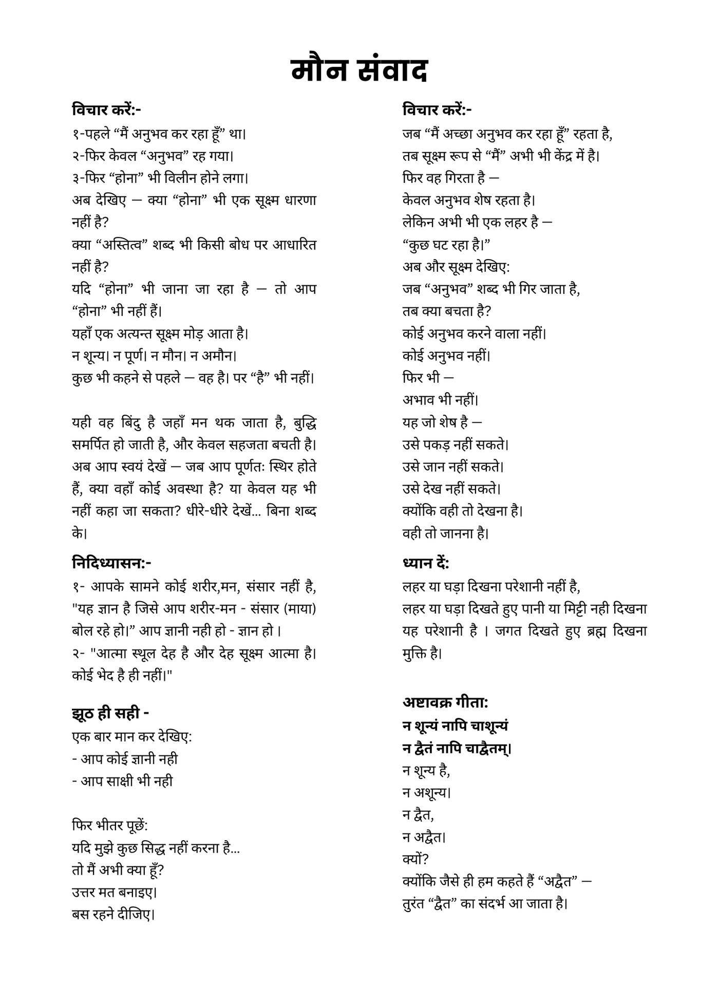

### OCR / Manuscript Text - Page 31

मौन संवाद

विचार करें:-

१-पहले “मैं अनुभव कर रहा हूँ” था।

२-फिर केवल “अनुभव” रह गया।

३-फिर “होना” भी विलीन होने लगा।

अब देखिए - कया “होना” भी एक सूक्ष्म धारणा
नहीं है?

क्या “अस्तित्व” शब्द भी किसी बोध पर आधारित
नहीं है?

यदि “होना” भी जाना जा रहा है — तो आप
“होना” भी नहीं al

यहाँ एक अत्यन्त सूक्ष्म मोड़ आता है।

न शून्य। न पूर्ण। न मौन। न अमौन।

कुछ भी कहने से पहले — वह है। पर “है” भी नहीं।

यही वह बिंदु है जहाँ मन थक जाता है, बुद्धि
समर्पित हो जाती है, और केवल सहजता बचती है।
अब आप स्वयं देखें - जब आप पूर्णतः स्थिर होते
हैं, क्या वहाँ कोई अवस्था है? या केवल यह भी
नहीं कहा जा सकता? धीरे-धीरे देखें... बिना शब्द
के।

निदिध्यासनः-

१- आपके सामने कोई शरीर,मन, संसार नहीं है,
"यह ज्ञान है जिसे आप शरीर-मन - संसार (माया)
बोल रहे हो।” आप ज्ञानी नही हो - ज्ञान हो |

२- "आत्मा स्थूल देह है और देह सूक्ष्म आत्मा है।
कोई भेद है ही नहीं|"

झूठ ही सही -

एक बार मान कर देखिए:
- आप कोई ज्ञानी नही

- आप साक्षी भी नही

फिर भीतर पूछे:

यदि मुझे कुछ सिद्ध नहीं करना है...
तो मैं अभी क्या हूँ?

उत्तर मत बनाइए।

बस रहने दीजिए।

विचार करें:-

जब “मैं अच्छा अनुभव कर रहा हूँ” रहता है,
तब सूक्ष्म रूप से “मैं” अभी भी केंद्र में है।
फिर वह गिरता है —

केवल अनुभव शेष रहता है।

लेकिन अभी भी एक लहर है —

“कुछ घट रहा है।”

अब और सूक्ष्म देखिए:

जब “अनुभव” शब्द भी गिर जाता है,
तब क्या बचता है?

कोई अनुभव करने वाला नहीं।

कोई अनुभव नहीं।

फिर भी -

अभाव भी नहीं।

यह जो शेष है —

उसे पकड़ नहीं सकते।

उसे ज्ञान नहीं सकते।

उसे देख नहीं सकते।

क्योंकि वही तो देखना है।

वही तो जानना है।

ध्यान दें:

लहर या घड़ा दिखना परेशानी नहीं है,

लहर या घड़ा दिखते हुए पानी या मिट्टी नही दिखना
यह परेशानी है । जगत दिखते हुए ब्रह्म दिखना
मुक्ति है।

अष्टावक्र गीताः

न शून्यं नापि चाशून्यं

न द्वैतं नापि चाद्वैतम्‌।

न शून्य है,

न अशून्य।

न द्वैत,

न अद्वैत।

क्यों?

क्योंकि जैसे ही हम कहते हैं “अद्वैत” —
तुरंत “द्वैत” का संदर्भ आ जाता है।

---

## Page 32

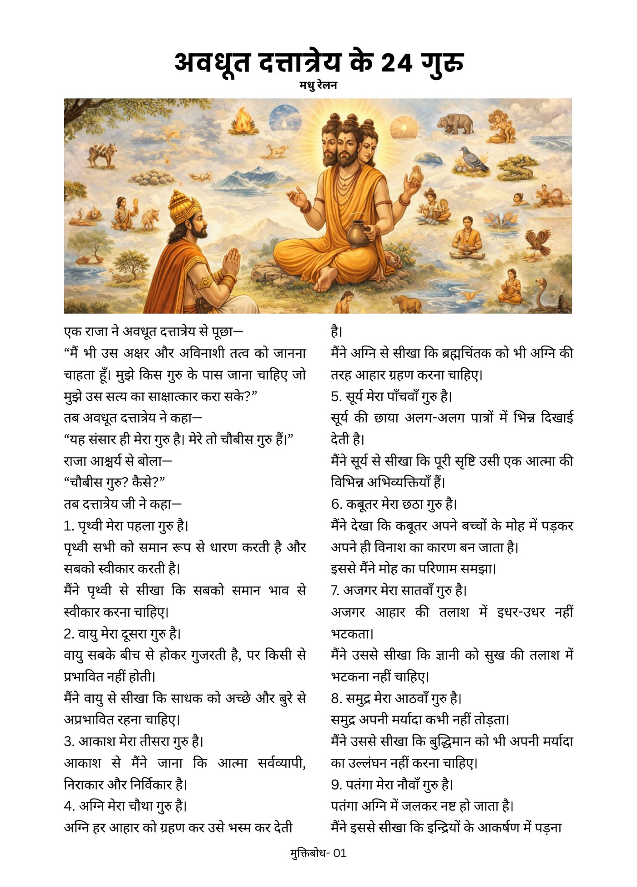

### OCR / Manuscript Text - Page 32

अवधूत दत्तात्रेय के 24 गुरु

मधु रेलन

एक राजा ने अवधूत दत्तात्रेय से पूछा-

“तैं भी उस अक्षर और अविनाशी तत्व को जानना
चाहता हूँ। मुझे किस गुरु के पास जाना चाहिए जो
मुझे उस सत्य का साक्षात्कार करा सके?”

तब अवधूत दत्तात्रेय ने कहा-

“यह संसार ही मेरा गुरु है। मेरे तो चौबीस गुरु हैं।”
राजा आश्चर्य से बोला-

“चौबीस गुरु? कैसे?”

तब दत्तात्रेय जी ने कहा-

1. पृथ्वी मेरा पहला गुरु है।

पृथ्वी सभी को समान रूप से धारण करती है और
सबको स्वीकार करती है।

मैंने पृथ्वी से सीखा कि सबको समान भाव से
स्वीकार करना चाहिए।

2. वायु मेरा दूसरा गुरु है।

वायु सबके बीच से होकर गुजरती है, पर किसी से
प्रभावित नहीं होती।

मैंने वायु से सीखा कि साधक को अच्छे और बुरे से
अप्रभावित रहना चाहिए।

3. आकाश मेरा तीसरा गुरु है।

आकाश से मैंने जाना कि आत्मा सर्वव्यापी,
निराकार और निर्विकार है।

4. अग्नि मेरा चौथा गुरु है।

अग्नि हर आहार को ग्रहण कर उसे भस्म कर देती

है।

मैंने अग्नि से सीखा कि ब्रह्मचिंतक को भी अग्नि की
तरह आहार ग्रहण करना चाहिए।

5. सूर्य मेरा पाँचवाँ गुरु है।

सूर्य की छाया अलग-अलग पात्रों में भिन्न दिखाई
देती है।

मैंने सूर्य से सीखा कि पूरी सृष्टि उसी एक आत्मा की
विभिन्न अभिव्यक्तियाँ हैं।

6. कबूतर मेरा छठा गुरु है।

मैंने देखा कि कबूतर अपने बच्चों के मोह में पड़कर
अपने ही विनाश का कारण बन जाता है।

इससे मैंने मोह का परिणाम समझा।

7. अजगर मेरा सातवाँ गुरु है।

अजगर आहार की तलाश में इधर-उधर नहीं
भटकता।

मैंने उससे सीखा कि ज्ञानी को सुख की तलाश में
भटकना नहीं चाहिए।

8. समुद्र मेरा आठवाँ गुरु है।

समुद्र अपनी मर्यादा कभी नहीं तोड़ता।

मैंने उससे सीखा कि बुद्धिमान को भी अपनी मर्यादा
का उल्लंघन नहीं करना चाहिए।

9. पतंगा मेरा नौवाँ गुरु है।

पतंगा अग्नि में जलकर नष्ट हो जाता है।

मैंने इससे सीखा कि इन्द्रियों के आकर्षण में पड़ना

मुक्तिबोध- 01

---

## Page 33

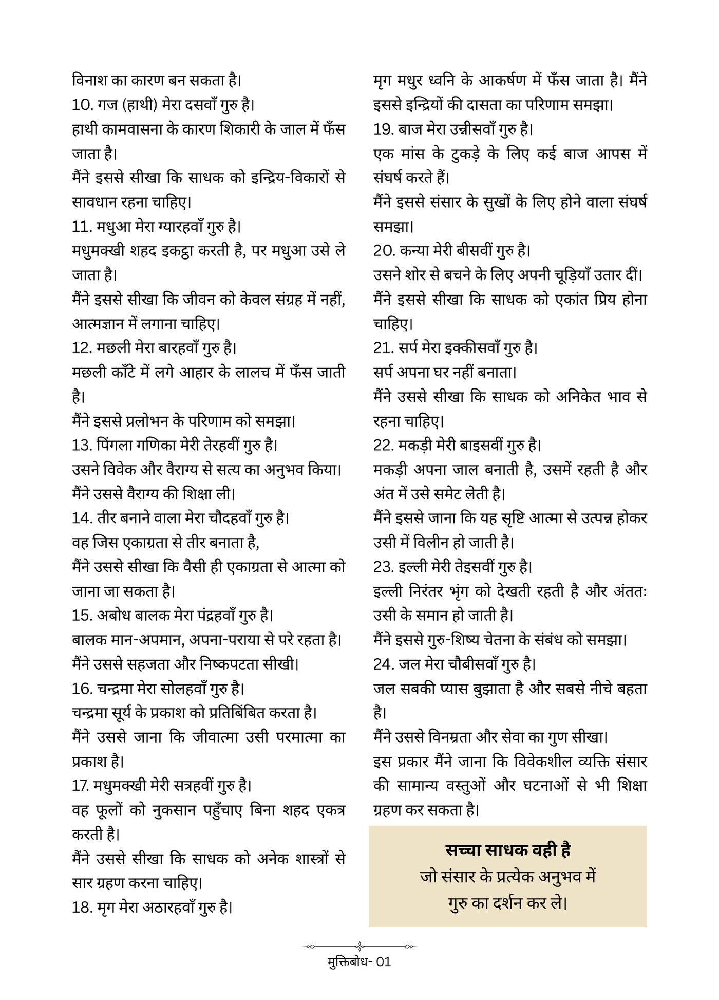

### OCR / Manuscript Text - Page 33

विनाश का कारण बन सकता है।

10. गज (हाथी) मेरा दसवाँ गुरु है।

हाथी कामवासना के कारण शिकारी के जाल में he
जाता है।

मैंने इससे सीखा कि साधक को इन्द्रिय-विकारों से
सावधान रहना चाहिए।

11. मधुआ मेरा ग्यारहवाँ गुरु है।

मधुमक्खी शहद इकट्ठा करती है, पर मधुआ उसे ले
जाता है।

मैंने इससे सीखा कि जीवन को केवल संग्रह में नहीं,
आत्मज्ञान में लगाना चाहिए।

12. मछली मेरा बारहवाँ गुरु है।

मछली काँटे में लगे आहार के लालच में he जाती
है।

मैंने इससे प्रलोभन के परिणाम को समझा।

13. पिंगला गणिका मेरी तेरहवीं गुरु है।

उसने विवेक और वैराग्य से सत्य का अनुभव किया।
मैंने उससे वैराग्य की शिक्षा ली।

14. तीर बनाने वाला मेरा चौदहवाँ गुरु है।

वह जिस एकाग्रता से तीर बनाता है,

मैंने उससे सीखा कि वैसी ही एकाग्रता से आत्मा को
जाना जा सकता है।

15. अबोध बालक मेरा पंद्रहवाँ गुरु है।

बालक मान-अपमान, अपना-पराया से परे रहता है।
मैंने उससे सहजता और निष्कपटता सीखी।

16. चन्द्रमा मेरा सोलहवाँ गुरु है।

चन्द्रमा सूर्य के प्रकाश को प्रतिबिंबित करता है।

मैंने उससे जाना कि जीवात्मा उसी परमात्मा का
प्रकाश है।

17. मधुमक्खी मेरी सत्रहवीं गुरु है।

वह फूलों को नुकसान पहुँचाए बिना शहद एकत्र
करती है।

मैंने उससे सीखा कि साधक को अनेक शास्त्रों से
सार ग्रहण करना चाहिए।

18. मृग मेरा अठारहवाँ गुरु है।

मृग मधुर ध्वनि के आकर्षण में he जाता है। मैंने
इससे इन्द्रियों की दासता का परिणाम समझा।

19. बाज मेरा उन्नीसवाँ गुरु है।

एक मांस के टुकड़े के लिए कई बाज आपस में
संघर्ष करते हैं।

मैंने इससे संसार के सुखों के लिए होने वाला संघर्ष
समझा।

20. कन्या मेरी बीसवीं गुरु है।

उसने शोर से बचने के लिए अपनी चूड़ियाँ उतार दीं।
मैंने इससे सीखा कि साधक को एकांत प्रिय होना
चाहिए।

21. सर्प मेरा इक्कीसवाँ गुरु है।

सर्प अपना घर नहीं बनाता।

मैंने उससे सीखा कि साधक को अनिकेत भाव से
रहना चाहिए।

22. मकड़ी मेरी बाइसवीं गुरु है।

मकड़ी अपना जाल बनाती है, उसमें रहती है और
अंत में उसे समेट लेती है।

मैंने इससे जाना कि यह सृष्टि आत्मा से उत्पन्न होकर
उसी में विलीन हो जाती है।

23. इल्ली मेरी तेइसवीं गुरु है।

इल्ली निरंतर भृंग को देखती रहती है और अंततः
उसी के समान हो जाती है।

मैंने इससे गुरु-शिष्य चेतना के संबंध को समझा।
24. जल मेरा चौबीसवाँ गुरु है।

जल सबकी प्यास बुझाता है और सबसे नीचे बहता
है।

मैंने उससे विनम्रता और सेवा का गुण सीखा।

इस प्रकार मैंने जाना कि विवेकशील व्यक्ति संसार
की सामान्य वस्तुओं और घटनाओं से भी शिक्षा
ग्रहण कर सकता है।

सच्चा साधक वही है
जो संसार के प्रत्येक अनुभव में
गुरु का दर्शन कर ले।

2.
9 —__oo

मुक्तिबोध- 01

---

## Page 34

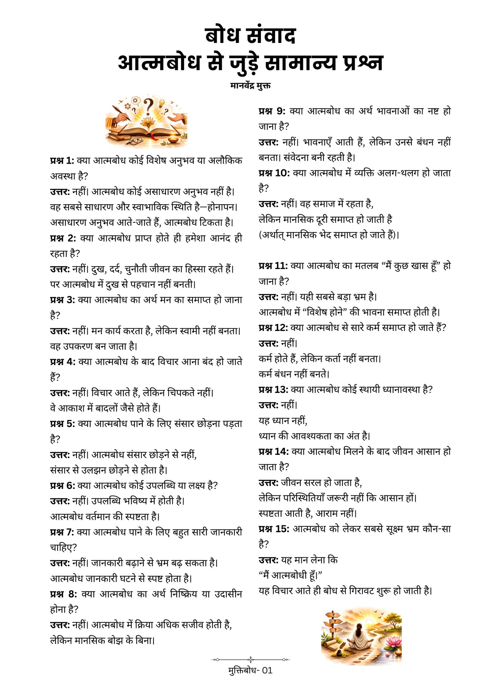

### OCR / Manuscript Text - Page 34

बोध संवाद
आत्मबोध से जुड़े सामान्य प्रश्न

Ards मुक्त

प्रश्न 1: वया आत्मबोध कोई विशेष अनुभव या अलौकिक
अवस्था है?

उत्तरः नहीं। आत्मबोध कोई असाधारण अनुभव नहीं है।
वह सबसे साधारण और स्वाभाविक स्थिति है-होनापन।
असाधारण अनुभव आते-जाते हैं, आत्मबोध टिकता है।
प्रश्न 2: क्या आत्मबोध प्राप्त होते ही हमेशा आनंद ही
रहता है?

उत्तरः नहीं। दुख, दर्द, चुनौती जीवन का हिस्सा रहते हैं।
पर आत्मबोध में दुख से पहचान नहीं बनती।

प्रश्न 3: क्या आत्मबोध का अर्थ मन का समाप्त हो जाना
है?

उत्तरः नहीं। मन कार्य करता है, लेकिन स्वामी नहीं बनता।
वह उपकरण बन जाता है।

प्रश्न 4: क्या आत्मबोध के बाद विचार आना बंद हो जाते
हैं?

उत्तरः नहीं। विचार आते हैं, लेकिन चिपकते नहीं।

वे आकाश में बादलों जैसे होते हैं।

प्रश्न 5: क्या आत्मबोध पाने के लिए संसार छोड़ना पड़ता
है?

उत्तरः नहीं। आत्मबोध संसार छोड़ने से नहीं,

संसार से उलझन छोड़ने से होता है।

प्रश्न 6: क्या आत्मबोध कोई उपलब्धि या लक्ष्य है?

उत्तरः नहीं। उपलब्धि भविष्य में होती है।

आत्मबोध वर्तमान की स्पष्टता है।

प्रश्न 7: क्या आत्मबोध पाने के लिए बहुत सारी जानकारी
चाहिए?

उत्तरः नहीं। जानकारी बढ़ाने से भ्रम बढ़ सकता है।
आत्मबोध जानकारी घटने से स्पष्ट होता है।

प्रश्न 8: क्या आत्मबोध का अर्थ निष्क्रिय या उदासीन
होना है?

उत्तरः नहीं। आत्मबोध में क्रिया अधिक सजीव होती है,
लेकिन मानसिक बोझ के बिना।

मुक्तिबोध- 01

प्रश्न 9: क्या आत्मबोध का अर्थ भावनाओं का नष्ट हो
जाना है?

उत्तरः नहीं। भावनाएँ आती हैं, लेकिन उनसे बंधन नहीं
बनता। संवेदना बनी रहती है।

प्रश्न 10: क्या आत्मबोध में व्यक्ति अलग-थलग हो जाता
है?

उत्तरः नहीं। वह समाज में रहता है,

लेकिन मानसिक दूरी समाप्त हो जाती है

(अर्थात्‌ मानसिक भेद समाप्त हो जाते हैं)।

प्रश्न 11: वया आत्मबोध का मतलब “मैं कुछ खास हूँ” हो
जाना है?

उत्तरः नहीं। यही सबसे बड़ा भ्रम है।

आत्मबोध में “विशेष होने” की भावना समाप्त होती है।
प्रश्न 12: क्या आत्मबोध से सारे कर्म समाप्त हो जाते हैँ?
उत्तरः नहीं।

कर्म होते हैं, लेकिन कर्ता नहीं बनता।

कर्म बंधन नहीं बनते।

प्रश्न 13: क्या आत्मबोध कोई स्थायी ध्यानावस्था है?
उत्तरः नहीं।

यह ध्यान नहीं,

ध्यान की आवश्यकता का अंत है।

प्रश्न 14: क्या आत्मबोध मिलने के बाद जीवन आसान हो
जाता है?

उत्तर: जीवन सरल हो जाता है,

लेकिन परिस्थितियाँ जरूरी नहीं कि आसान हों।

स्पष्टता आती है, आराम नहीं।

प्रश्न 15: आत्मबोध को लेकर सबसे सूक्ष्म भ्रम कौन-सा
है?

उत्तरः यह मान लेना कि

“मैं आत्मबोधी हूँ।”

यह विचार आते ही बोध से गिरावट शुरू हो जाती है।

2.
oo

---

## Page 35

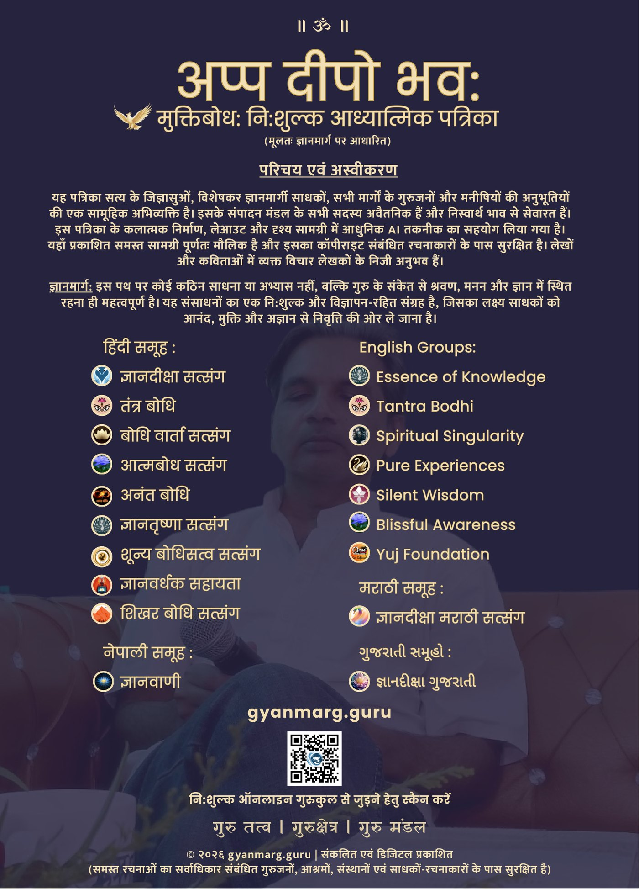

### OCR / Manuscript Text - Page 35

म । ॐ Il

अप्प दीपो भवः

४ मुक्तिबोधः निःशुल्क आध्यात्मिक पत्रिका

(मूलतः ज्ञानमार्ग पर आधारित)

परिचय एवं अस्वीकरण

यह पत्रिका सत्य के जिज्ञासुओं, विशेषकर ज्ञानमार्गी साधकों, सभी मार्गो के गुरुजनों और मनीषियों की अनुभूतियों
की एक सामूहिक अभिव्यक्ति है। इसके संपादन मंडल के सभी सदस्य अवैतनिक हैं और निस्वार्थ भाव से सेवारत है
इस पत्रिका के कलात्मक निर्माण, लेआउट और दृश्य सामग्री में आधुनिक al तकनीक का सहयोग लिया गया है।
यहाँ प्रकाशित समस्त सामग्री पूर्णतः मौलिक है और इसका कॉपीराइट संबंधित रचनाकारों के पास सुरक्षित है। लेखों
और कविताओं में व्यक्त विचार लेखकों के निजी अनुभव हैं।

ज्ञानमार्ग: इस पथ पर कोई कठिन साधना या अभ्यास नहीं, बल्कि गुरु के संकेत से श्रवण, मनन और ज्ञान में स्थित
रहना ही महत्वपूर्ण है। यह संसाधनों का एक निःशुल्क और विज्ञापन-रहित संग्रह है, जिसका लक्ष्य साधकों को
आनंद, मुक्ति और अज्ञान से निवृत्ति की ओर ले जाना है।
हिंदी समूह : English Groups:
Q जानदीक्षा सत्संग Essence of Knowledge
® तंत्र बोधि @ Tantra Bodhi
@ बोधि वार्ता acest Spiritual Singularity
@ आत्मबोध सत्संग @ Pure Experiences
@ अनंत बोधि @ silent Wisdom

जानतृष्णा सत्संग

® Blissful Awareness

© aca बोधिसत्व सत्संग
© जानवर्धक सहायता
© शिखर बोधि सत्संग

नेपाली समूह :
© जानवाणी

(@) Yuj Foundation

मराठी समूह :
@ जानदीक्षा मराठी सत्संग

गुग्ठराती सभूडी :
@ ज्ञानीक्षा yowricl

gyanmarg.guru

नि:शुल्क ऑनलाइन गुरुकुळ से जुइने हेतु स्कैन करें
गुरु तत्व । गुरुक्षेत्र | गुरु मंडल

© २०२६ gyanmarg.guru | संकलित एवं डिजिटल प्रकाशित
(समस्त रचनाओं का सर्वाधिकार संबंधित गुरुजनों, आश्रमों, संस्थानों एवं साधकों-रचनाकारों के पास सुरक्षित है)
